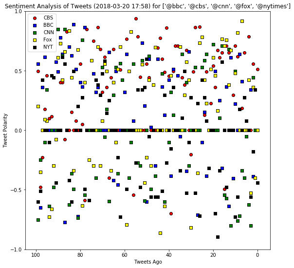
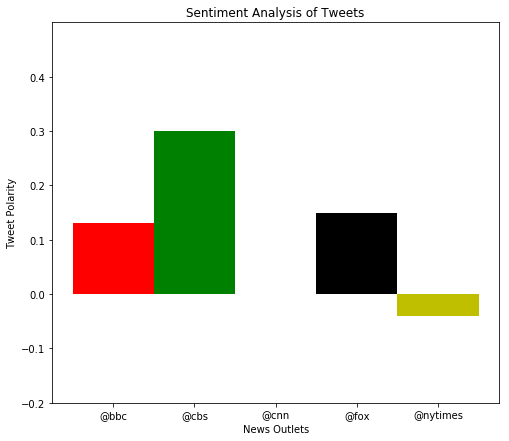

```python
import tweepy
import json
import pandas as pd
import numpy as np
from datetime import datetime
import matplotlib.pyplot as plt
from config import consumer_key, consumer_secret, access_token, access_token_secret

```


```python
# Setup Tweepy API Authentication
auth = tweepy.OAuthHandler(consumer_key, consumer_secret)
auth.set_access_token(access_token, access_token_secret)
api = tweepy.API(auth, parser=tweepy.parsers.JSONParser())
```


```python
from vaderSentiment.vaderSentiment import SentimentIntensityAnalyzer
analyzer = SentimentIntensityAnalyzer()
```


```python

#BBC, CBS, CNN, Fox, and New York times.
# Target User Account"
target_users = ["@bbc", "@cbs", "@cnn", "@fox", "@nytimes"]

sentiments=[]
counter =0
#Loop through the news site list
for target_user in target_users:
    
    
    #for each news site, Loop through 5 pages of tweets (total 100 tweets)
    for x in range(5):

        #Get all tweets from home feed
        public_tweets = api.user_timeline(target_user, page=x+1)


        # Loop through all tweets
        for tweet in public_tweets:

            # Run Vader Analysis on each tweet, target the text in each tweet. 
            results = analyzer.polarity_scores(tweet["text"])
            compound = results["compound"]
            pos = results["pos"]
            neu = results["neu"]
            neg = results["neg"]
            date=tweet["created_at"]

        # Add each value to the appropriate list
        #compound_list.append(compound)
        #positive_list.append(pos)
        #negative_list.append(neg)
        #neutral_list.append(neu)
        #date_list.append(date)
        #tweets_ago.append(counter)
        #put all into dictionary
            sentiments.append({"Date": tweet["created_at"],
                               "User":target_user,
                           "Compound": compound,
                           "Positive": pos,
                           "Negative": neu,
                           "Neutral": neg,
                           "Tweets Ago": counter,
                            "Text":tweet['text']})
        
            counter=counter+1
        
            print(tweet["text"], tweet['user']['screen_name'])
            print()
            
    #reset the counter when it shifts to new target user
    counter=0

```

    This #WorldFrogDay, why not try making an origami jumping frog with @BBCTaster's step-by-step tutorial? 🐸… https://t.co/jjMqUND883 BBC
    
    Michael Portillo travels across India guided by Bradshaw's 1913 Handbook of Indian, Foreign and Colonial Travel. 🇮🇳… https://t.co/4WG0esDk8m BBC
    
    Can you watch this without laughing? 😹🔊 You'll want your sound on for this! #InternationalDayOfHappiness
    
    https://t.co/vA5yr0PCC5 BBC
    
    Professor Stephen Hawking's funeral will take place in Cambridge - "the city that he loved so much and which loved… https://t.co/LHh0Nfeh6U BBC
    
    Un-bee-lievable! 🐝😍 Meet the woman who kept a bee as a pet. 
    https://t.co/5zRxWpSGOH BBC
    
    Arise, Sir Ringo! 🎖🎶@thebeatles drummer @ringostarrmusic has been knighted for his services to music.… https://t.co/OQLixgO2Zi BBC
    
    The first polar bear cub to be born in the UK for 25 years has emerged from his den at Scotland's Highland Wildlife… https://t.co/WZLoy2mz7y BBC
    
    'Everybody has a voice'. ❤️️🎶
    
    Rugby legends JPR Williams and JJ Williams visit @FMNChorus and the BBC National Cho… https://t.co/myuIpumZnL BBC
    
    📸The best pictures from the 2018 Paralympic Winter Games in Pyeongchang: https://t.co/w8dYDPHkAw https://t.co/0SVnupv9rB BBC
    
    Prince Harry and Meghan Markle have chosen an organic lemon and elderflower cake for their wedding in May. 🍰🍋💍… https://t.co/H7dWlxmYcR BBC
    
    RT @BBCWalesNews: 🎟🎞🍿Cinema makes maths class an offer they can't refuse
    Full story: https://t.co/Uwg6NTRFVF https://t.co/hr4dglHIu3 BBC
    
    People always have an opinion. 🙄😂 Here's why @AlanCarr doesn't trust TripAdvisor reviews. #LiveAtTheApollo 
    
    https://t.co/PvF6K9hYMI BBC
    
    From a spot of spring cleaning to rolling cheese down a hill... 🕸🧀🌱
    
    Here are nine ways to celebrate spring!… https://t.co/ujBmBsHast BBC
    
    Sudan, the world's last surviving male northern white rhino has died after months of ill health. 💔🦏… https://t.co/BnYne3cI2L BBC
    
    This #InternationalDayOfHappiness, let's all try to be a little more like @chessmartinez. 😊👏#LiveAtTheApollo 
    
    https://t.co/VddL8zWJfS BBC
    
    RT @BBCOne: They've finally quacked the case.
    
    https://t.co/eq4dLcauhe BBC
    
    RT @BBCEarth: Sudan’s death leaves just two females of the subspecies alive in the world 
    https://t.co/kCpRCxFaFY BBC
    
    RT @bbcthree: RuPaul is the first drag queen to get a Hollywood star. Sissy that Walk of Fame.  https://t.co/SmqOPQizh3 https://t.co/hWb1Xm… BBC
    
    RT @BBCBreakfast: ❄️❄️BBRRR....Could it be the coldest day yet for the Spring Equinox?
    Let us know what temp it is where you are today.  #S… BBC
    
    Meet Bumblebee and Gnat, two adorable badger cubs being raised at an animal sanctuary. 😍
    https://t.co/Ihami0VtL0 BBC
    
    Spring is here! But what is the #SpringEquinox? 🌺🌻🌸🌱https://t.co/RiWP3PC7Yo https://t.co/FIKocYFP6C BBC
    
    Five times Beyonce and Jay-Z’s daughter Blue Ivy outshone her parents. ⭐️ https://t.co/JaNAzsofOm https://t.co/DnoyApY0yL BBC
    
    Traditional Highland Games sports such as tossing the caber and tug-of-war are to be taught in PE lessons. 🏆… https://t.co/jv5wlpmlyT BBC
    
    Follow the dramatic and deadly series of events that took place at two funerals in Belfast in March 1988. 
    
    The Fun… https://t.co/y3MZaR8hsi BBC
    
    Leonardo DiCaprio stars in the true story of a con man who cashed fake cheques worth millions. 
    
    Catch Me If You Ca… https://t.co/HWShPj9ngi BBC
    
    😂📸 @AlanCarr learned the hard way that you only get one shot at a school photo. #LiveAtTheApollo 
    
    https://t.co/fv5JmcRgz4 BBC
    
    🎤Pop band @FifthHarmony have announced they're taking a break to pursue solo careers 🎶https://t.co/tLOR7h1gZy https://t.co/5c77Cfjfp6 BBC
    
    Murder. Innocence. Lies. 
    
    @AgathaChristie classic, #OrdealByInnocence, comes to @BBCOne soon.
    https://t.co/qfJThHowXC BBC
    
    Here are the latest snow scenes from around the UK. ❄️📸 https://t.co/eTBGkQ4MPU https://t.co/txRHxkOn5C BBC
    
    'Flabbergasted'. 🎶This is the incredible moment when eight London teenagers heard a live opera singer for the first… https://t.co/jNki4Z61SE BBC
    
    Meet the dancing slum kids tipped for stardom by Rihanna 🎶
    https://t.co/R61fzQGIzd https://t.co/wGcvBKmdaZ BBC
    
    RT @bbcgetinspired: The Nation's Billion Steps Challenge is here! 🙌 
    
    Yesterday we did an amazing 431 million steps – can we do even better… BBC
    
    💭 "There's always that voice in the back of your head that says you're not good enough". 
    
     💪 @CarrieHFletcher on b… https://t.co/0AsBxFFiQA BBC
    
    RT @BBCRadioScot: This must have been some buzz! 🐝🐝🐝 https://t.co/0gqtbQBN1i BBC
    
    Where are the UK's youngest and oldest city populations? https://t.co/eIU7UzqHBS https://t.co/vdXMTDluuX BBC
    
    RT @BBCSport: This 102-shot badminton rally will leave you exhausted... https://t.co/LFC4r4iwiz BBC
    
    Have you got a passion for plants? 🌿🌸🌱🍃🌷
    
    Test your knowledge of all things foliage in this quiz. 👉… https://t.co/evogV5ljAc BBC
    
    RT @BBCSport: 🎉 The Commonwealth Games are almost upon us! 🎉
    
    Scotland's Lynsey Sharp has given us the inside track on preparing for succes… BBC
    
    The oldest dog that the Dogs Trust has ever looked after has been given a new home. ❤️️🐶https://t.co/h0WQHkfMEf https://t.co/ixb7gesOIj BBC
    
    RT @BBCR1: Desperately searching for any signs of spring like... 🌸
    
    #MondayMotivation https://t.co/9jo3h4C7bu BBC
    
    RT @BBCRadioWales: ❄️ Snowy Cardiff! ⛄️ 
    
    What’s it like for you?
    
    #ButePark 
    #Cardiff 
    #MiniBeast
    #Snow https://t.co/O8gY1qjHVE BBC
    
    RT @BBCNews: Stem cell transplant "game changer" for MS patients https://t.co/BGWtdtXUAP BBC
    
    RT @BBCBreakfast: Anyone want to play a game of spot Tracey's feet? Our floor manager Tracey had to dive behind the sofa to avoid being on… BBC
    
    'Who wants a normal life?' We should all be a little more like @chessmartinez. 👏💖 #LiveAtTheApollo
    
    https://t.co/VddL8zWJfS BBC
    
    RT @BBCWthrWatchers: Some incredible photos sent in last night of the #Auroraborealis from Skye Woody, Cumbrian stargazer and DJStewie.  Di… BBC
    
    Beautiful spring blossom in south-west China has been captured by drone https://t.co/WTo7JjiKXw BBC
    
    🤔 Should we still be worried about the hole in the ozone layer?
    
    🌤 @SimonOKing and @clarenasir investigate in their… https://t.co/SZV3Df9y0t BBC
    
    🏃💪 @LesDennis, @SimplySusannah, @Tameka_Empson and Miles Jupp embark on a muscle-grinding mission to regain their f… https://t.co/B1rXaalmk2 BBC
    
    👎💌 Fans of K-Pop boyband member @IBGDRGN have been asked to stop sending fan mail to the army base where he's doing… https://t.co/ojtDZ3gMfb BBC
    
    Saoirse Ronan stars as Eilis, a young girl who jumps at the chance of a better life when she emigrates to New York.… https://t.co/NtHAfh6cjZ BBC
    
    Ruth Ellis was only 28 when she became the last woman hanged to death in the UK. 
    
    #TheRuthEllisFiles | Watch on… https://t.co/5kUIFtom7t BBC
    
    RT @BBC_TopGear: 840bhp goes a little like this…
    
    @Matt_LeBlanc takes the Dodge Challenger SRT #Demon to the drag strip in this Sunday’s @T… BBC
    
    RT @bbcthree: Be honest, do you think you'll be this fit at 81? https://t.co/Eca0uGCF6b BBC
    
    🍎🗑 How much food do you throw away? If you're a typical Brit, you probably think it's hardly any.
    
    You're in denial… https://t.co/0bSCbRrZJr BBC
    
    ❤️️📸Zun Lee wants his photography to give a balanced and nuanced portrayal of black fatherhood.
    
    👉… https://t.co/LodRrr27fd BBC
    
    🤰 A doctor explains why you can get pregnant and give birth without having a baby bump. 
    👉 https://t.co/nVrSpQoTOT https://t.co/iEEOjZdBKL BBC
    
    RT @BBCEngland: A number of runners have held their own half-marathon in Reading after the official event was called off due to the snowy w… BBC
    
    RT @BBCSport: They’ve done it! Gold for GB’s Menna Fitzpatrick and Jen Kehoe in the visually impaired slalom at the Winter Paralympics. And… BBC
    
    📱🚗 Why a rise in electric cars could also mean a hike in the cost of your next phone. https://t.co/6i5xFQgRIW BBC
    
    RT @BBC6Music: ✏️ Which song has the greatest opening line? BBC
    
    🎤Pop music is awash with those that released one hit album and never followed it up. Here are 7 huge artists that o… https://t.co/4ukT9drcdG BBC
    
    🍔😲 Would you eat a burger pie?  
    #BackInTimeForTea https://t.co/zGWzJwdSlM BBC
    
    RT @BBCOne: If food is the language of love... https://t.co/5hnYovE94o BBC
    
    Ever wondered why David Bowie wore an eye patch?
    
    Strange things artists have worn on stage and the reasons why. 
    👉… https://t.co/8zSBXQkLvy BBC
    
    🍞🥖 Want to learn how to bake bread?
    
    These easy to follow recipes and step-by-step videos will have you baking ever… https://t.co/iXEmj5WJdD BBC
    
    “I regret spending £50,000 on my wedding.” https://t.co/6PxJsDf9dn https://t.co/eJdx7KMmmK BBC
    
    How to be 20 on the inside, even when you’re 80 on the outside... https://t.co/KB2mqpkrIB BBC
    
    RT @BBCNews: Snow and ice are bringing disruption to many parts of the UK - but they're not stopping everyone from having fun 🐶❄️
    
    https://… BBC
    
    RT @bbc5live: The beast from the east is back ❄️🌨️
    
    You've been in touch this morning with your #uksnow pics, here are just a few...
    
    What'… BBC
    
    These seven celebrities are about to go on the journey of a lifetime... #Pilgrimage
    https://t.co/m45UBXJew2 BBC
    
    Can we just take a moment to discuss Eddie Redmanyne's coats?https://t.co/odVkhWyRKs BBC
    
    Ouch! 😂🔥@GordonRamsay's daughter is hilarious... 
    https://t.co/0dqwntX5uj BBC
    
    🐜1⃣2⃣3⃣Sir David Attenborough explores whether there is counting in the natural world. 
    
    David Attenborough's Natur… https://t.co/Q4H4uXR4pt BBC
    
    One of the writers for The Simpsons has told @BBCNewsbeat Stephen Hawking was such a big fan of the show - he'd sho… https://t.co/Jjer3V4cYk BBC
    
    🎓📚 'The moment I gave Reese Witherspoon my Legally Blonde dissertation... and yes, it was scented.'
    👉… https://t.co/z8x5mqqKoW BBC
    
    RT @BBCWorld: Blossom in south-west China captured by drone https://t.co/gIDKUn1La6 BBC
    
    This year, over 250 landmarks across the globe are going green for #StPatricksDay! 🍀 https://t.co/TlWqU0TXQT https://t.co/i4sW4OaGrQ BBC
    
    RT @BBCRadio3: "Even if we found a complete theory of the universe, it wouldn't remove the need for music" - #StephenHawking
    https://t.co/t… BBC
    
    ⛷❤️ George has autism and other health conditions - but his love of skiing is helping him take on the outside world. https://t.co/kfCzRzkcNY BBC
    
    RT @5liveSport: 'My mates didn't know I was playing @realmadrid'
    
    @ManUtd's @carras16 tells @ColinMurray his friends keep him grounded…
    
    'A… BBC
    
    Yes, Gary Oldman and @BBCEastEnders' Big Mo are brother and sister. 
    
    But do you know these other celeb family ties… https://t.co/dtzMwD3nBB BBC
    
    RT @BBCOne: .@NiallOfficial won't let fame get to his head - Ireland won't allow it. 
    
    Happy #StPatricksDay 🍀 https://t.co/OrWR94HStF BBC
    
    ♻️🗑 This shop encourages you to bring your own container from home to save on single-use plastic waste. https://t.co/TdHJSycKtO BBC
    
    🇮🇪 🍀 Celebrate #StPatricksDay in true Irish style with these delicious recipes! 👉https://t.co/2MCMlz6K0B https://t.co/k18P3Syx2N BBC
    
    From scrambled eggs to chilli-spiced crisps: here are six great ways to cook with kale. 😋👉https://t.co/lqKD1h83Iv https://t.co/yWESBJm62q BBC
    
    RT @BBCTwo: Happy #StPatricksDay! Check out what's lurking beneath the calm waters of Ireland's west coast... 🇮🇪🦈 https://t.co/6MQgyLTlIr BBC
    
    🎶🐦 Did you know that bullfinches can learn to sing a tune by mimicking humans?
    
    🔊 Sound on for this one!  https://t.co/44OFulioZp BBC
    
    RT @BBCEngland: Stephen Hawking's PhD thesis has been viewed 250,000 times online since news of his death broke on Wednesday, the Universit… BBC
    
    Ready to get active?
    🏃 Here are 5 ways you can get involved in #SportRelief2018. 
    👉 https://t.co/wmKUWBDBjp https://t.co/xr7g5Hw4PK BBC
    
    RT @BBCR1: This guy just raised over a million pounds for @sportrelief 🙌🏻
    
    Congratulations on completing a truly mammoth task @gregjames, w… BBC
    
    💪😲⚽️ Keepy-uppy the good work! https://t.co/lFtKEBxjNJ BBC
    
    ❤️🎧 Bradley has never let Asperger's hold him back from doing what he loves. https://t.co/5JFvIXeDSZ BBC
    
    Running for the door on a Friday afternoon like...
    #FridayFeeling https://t.co/optoQcK1TV BBC
    
    🔊🎵Jarvis Cocker describes the dream-like experience of visiting La Monte Young's Dreamhouse.… https://t.co/O9u7sPRL5m BBC
    
    RT @BBCR1: The gruelling task of climbing Ben Nevis in underway for @gregjames after cycling 180 miles in a day and a half!
    
    Don't know abo… BBC
    
    Prepare to get that warm fuzzy feeling - the man who photobombed his wife 11 years before he met her:… https://t.co/iZBJ8dEKhz BBC
    
    🤔🎨 Why are soap bubbles such gorgeous colours? https://t.co/ppaXTcvWRZ BBC
    
    RT @BBCNewsPR: Get ready to make the headlines. 
    
    Try out our new BBC iReporter game, putting you in the heart of the newsroom #BBCSchoolRe… BBC
    
    😂 Fights, funerals, and giant furry heads... @BBCThree lifts the lid on the lives of English football's mascots
    👉… https://t.co/gEYxoetlah BBC
    
    RT @BBCRadio2: It's with a heavy heart that today we announce, after 18 fantastic years, @realLynnBowles is leaving Radio 2. 😢
    
    @realkenbru… BBC
    
    The legendary @Reba returns to host the 53rd #ACMawards and she’s proving just how comfortable she is behind the mi… https://t.co/XPXcSPRXqC CBS
    
    RT @nancyodell: Told my daughter I'd be presenting at @ACMawards again this year. (Woot woot!We both luv country music!)She took this pic o… CBS
    
    RT @ladyantebellum: Ecstatic to announce we'll be performing at the #ACMawards in Las Vegas again this year! https://t.co/Qfhs94j6FR CBS
    
    Country superstars @kennychesney, @ladyantebellum, @blakeshelton, and @KeithUrban have just been added to the stell… https://t.co/bJ4If7MacP CBS
    
    RT @YandR_CBS: Forever evolving, Forever inspiring, Forever Young and Restless. ❤️ Get ready to celebrate 45 years of #YR starting in just… CBS
    
    New start times in East/Central Time Zones: #60Minutes 7:37ET/6:37CT #Instinct series premiere 8:37ET/7:37CT… https://t.co/xT3YKqmu2M CBS
    
    Spend your Sunday streaming Second Round games LIVE with a FREE trial of CBS All Access! https://t.co/3P85rXLy4b https://t.co/zbWfirD9Ju CBS
    
    RT @instinctcbs: TONIGHT, Dr. Dylan Reinhart rewrites the book on abnormal behavior. Don't miss the premiere of #Instinct at 8/7c! https://… CBS
    
    If any duo knows how to rock the stage, it's @FLAGALine. The Vocal Duo Of The Year nominee will perform live at the… https://t.co/FknabB8NQp CBS
    
    How is your bracket looking after last night? Stream Second Round games LIVE today with a FREE trial of CBS All Acc… https://t.co/25JlIpgwog CBS
    
    Where better to spend #StPatricksDay than the place everybody knows your name? It’s just your luck that every singl… https://t.co/Fom5wmdENL CBS
    
    Stars @JakeMcDorman and Nik Dodani will join the cast in the upcoming revival of Murphy Brown coming to CBS.… https://t.co/JCAx29lo0i CBS
    
    RT @thegoodfight: Go behind the scenes with costume designer @DanLawsonStyle in "Behind The Style," a new weekly video series all about the… CBS
    
    The games have just begun! Continue to stream First Round games LIVE today with a FREE trial of CBS All Access:… https://t.co/YTGsJ48zYP CBS
    
    RT @TheTalkCBS: You asked, we answered! The fun never ends when the ladies #KeepTalking and answer your fan questions 🗣💬➡️ https://t.co/ie1… CBS
    
    RT @instinctcbs: Dr. Dylan Reinhart is lured back into the field from his life of quiet academia when a certain serial killer makes things… CBS
    
    Stream First Round games LIVE today starting at 12PM ET with a FREE trial of CBS All Access! https://t.co/3P85rXLy4b https://t.co/vZow3YD8cb CBS
    
    RT @CBSSports: It's the most wonderful time of the year. #MarchMadness https://t.co/e4c9qohqSR CBS
    
    Give these ladies some love! @Lauren_Alaina, @DBradbery, @carlypearce, and @RaeLynn are nominated for New Female Vo… https://t.co/IVhwURfJ3S CBS
    
    RT @ManWithAPlan: Hungry for more #ManWithAPlan bloopers and behind-the-scenes videos featuring cast like @matt_leblanc, @thelizasnyder, @k… CBS
    
    Music stars @MileyCyrus, @edsheeran, @ladygaga, and more will honor the legendary @eltonofficial and his hit songs… https://t.co/UzxARCCLnI CBS
    
    RT @thegoodfight: The verdict is in. The new season of #TheGoodFight is 🔥🔥🔥! Stream it now on CBS All Access: https://t.co/FkYSNSXlRb https… CBS
    
    RT @MadamSecretary: In less than an hour, #MadamSecretary's Keith Carradine will be taking over the @MadamSecretary Twitter page! Tweet alo… CBS
    
    RT @DierksBentley: Take and post a photo of the woman in your life who inspires you daily! Use the hashtag #WomanAmenACM in your post for a… CBS
    
    RT @MomCBS: If you missed guest star @KChenoweth in the latest episode of #Mom, not to worry! Watch now: https://t.co/RlvXoGOZ0l https://t.… CBS
    
    Give a round of applause to @KelseaBallerini, @MirandaLambert, @Reba, @MarenMorris, and @CarrieUnderwood, the five… https://t.co/Ncp1BTXx6N CBS
    
    RT @thegoodfight: Smart, sexy, and sophisticated. See what's coming this season on #TheGoodFight. https://t.co/CuKhx2G50P https://t.co/ygTI… CBS
    
    RT @BlueBloods_CBS: Even stand-up guys fall down sometimes. #BlueBloods is new tonight at 10/9c! https://t.co/UOlDm22wWW CBS
    
    Today and every day we celebrate the women in our lives who empower and inspire us. Share a story about an influent… https://t.co/9rVtqrElvT CBS
    
    Take and post a photo of the woman in your life who inspires you daily! Use the hashtag #WomanAmenACM in your post… https://t.co/7ShhvE48zy CBS
    
    RT @thegoodfight: Meticulously constructed. Soapy &amp; sexy. Intoxicating, savage television. 🔥 Here's what critics are saying about #TheGoodF… CBS
    
    This just in! @Jason_Aldean, @mirandalambert, @LukeBryanOnline, and many more are set to perform at the 53rd Academ… https://t.co/mfxw2VxzU4 CBS
    
    Meet the ensemble of talented actors slated to join $1, a new mystery series coming to CBS All Access:… https://t.co/QoyYv7vxwg CBS
    
    Will @Jason_Aldean, @garthbrooks, @LukeBryanOnline, @ChrisStapleton, or @KeithUrban be named Entertainer Of The Yea… https://t.co/rMD8zjeX3s CBS
    
    RT @thegoodfight: It feels good to be back. 👠💄🔥 The season 2 premiere of #TheGoodFight is now streaming, exclusively on CBS All Access: htt… CBS
    
    RT @thegoodfight: Tomorrow, #TheGoodFight is back. Stream the season 2 premiere only on CBS All Access: https://t.co/tNFR8LBJO2 https://t.c… CBS
    
    Who are the trailblazing women in your life that inspire you? Join CBS and the ANA's #SeeHer initiative, celebratin… https://t.co/M0KqZ41Bes CBS
    
    Join @maria_bello, @aishatyler and @TeaLeoni in celebrating the accomplishments of women who have contributed to th… https://t.co/MefESBeFL3 CBS
    
    In honor of Women's History Month, CBS and the Association of National Advertisers' (ANA) #SeeHer initiative will p… https://t.co/2wtYxKJVuO CBS
    
    RT @ZoeListerJones: Tonight’s an all new Life In Pieces and it’s directed by my ride or die @nataliaanderson!!!… https://t.co/2LPfmyLWrY CBS
    
    RT @MarenMorris: Hot damn! Woke up from my post-wisdom teeth haze to find out I’m up for 4 @ACMawards ! So honored, especially for the Dear… CBS
    
    RT @KelseaBallerini: Ohhhhh goodness. Incredible. Thank you thank you thank you. #female https://t.co/1ZTYjNfQeF CBS
    
    RT @KeithUrban: ACMs...... HOLY SMOKES!!!!! MAD LOVE TO U ALL THIS MORNING  FOR THESE INCREDIBLE NOMINATIONS. I’M EXTREMELY GRATEFUL!!!!!!!… CBS
    
    RT @ACMawards: Congratulations to this year’s #ACMawards Video of the Year nominees:
    “Black” - @DierksBentley
    “It Ain’t My Fault” - @Brothe… CBS
    
    RT @ACMawards: Please give a round of applause to this year’s #ACMawards Entertainer of the Year nominees: @Jason_Aldean, @GarthBrooks, @Lu… CBS
    
    .@ChrisStapleton, @ThomasRhett, @mirandalambert and more are all nominated for awards at Country Music's Party of t… https://t.co/Vm1vXRUDYJ CBS
    
    The Queen of Country, @Reba, is returning to host the 53rd #ACMawards on Sunday, April 15 at 8/7c. Here are a few o… https://t.co/Iqzz6Gql01 CBS
    
    RT @survivorcbs: It’s time! #Survivor https://t.co/YPk6cGWrUA CBS
    
    RT @CBSThisMorning: TOMORROW: The nominees for the 2018 @ACMawards will be announced live by the one-and-only, @Reba! 
    
    Watch on @CBS in ou… CBS
    
    RT @thegoodfight: From the set design and costumes to hair and makeup, the production quality is truly next-level. Take a peek inside the u… CBS
    
    RT @LivinBiblically: The fun continues on Facebook! The #LivingBiblically cast is live to talk about tonight’s premiere. Tune in here: http… CBS
    
    RT @KevinCanWaitCBS: Can you get all the way through these #KevinCanWait bloopers without laughing?! @KevinJames,@LeahRemini and the rest o… CBS
    
    RT @ACMawards: That’s right! @Reba is headed to @CBSThisMorning on Thursday, March 1 to announce this year’s #ACMAwards' nominees. Tune in… CBS
    
    RT @ScorpionCBS: You can't hack your way to a 197 IQ, but you are well on your way with these Genius Facts from #TeamScorpion! 💻 You can be… CBS
    
    RT @SuperiorDonuts: You can always count on @DavidKoechner for a laugh! Did your favorite Tush moment make the list? Catch a new #SuperiorD… CBS
    
    RT @TheTalkCBS: TODAY: We loved them together then &amp; we love seeing them together now! Welcome back to the show @THESaraGilbert​'s good fri… CBS
    
    RT @thegoodfight: As foundations begin to crumble, our characters struggle to make sense of this new dystopian world. The cast teases what'… CBS
    
    #LivingBiblically's @linzkraft and @jrfergjr appeared on @KCBS's Facebook Live this morning, talking all about what… https://t.co/4RebcHuuMQ CBS
    
    RT @CBSSports: Introducing CBS Sports HQ, a New 24/7 Direct-to-Consumer Streaming Network for Sports News, Highlights, &amp; Analysis.
    
    Stream… CBS
    
    RT @CBSBigBrother: It’s down to the final 5 celebrity Houseguests, and anyone could take home the grand prize! Tune in NOW to watch the #BB… CBS
    
    RT @startrekcbs: Binge the entire first season of #StarTrekDiscovery. All episodes now streaming exclusively on CBS All Access: https://t.c… CBS
    
    RT @thegoodfight: #TheGoodFight returns in 1 week. Season 2 premieres Sunday, March 4. https://t.co/nomCao1GWp https://t.co/BOn6bOe9Tb CBS
    
    RT @thegoodfight: This is our new favorite thing. Christine Baranski debuted #TheGoodFight the Musical on @colbertlateshow last night! 🎵🎤… CBS
    
    RT @LivinBiblically: Confession time: have YOU ever hit the "close door" button in an elevator while somebody was approaching? The cast of… CBS
    
    RT @CBSEyeSpeak: Mark your calendars! #CBSEyeSpeak kicks off March 14 with The EYE Speak Summit. Follow our page for more details! https://… CBS
    
    RT @CBSEyeSpeak: Proud to announce a new CBS initiative, promoting female empowerment and developing the next generation of leaders through… CBS
    
    RT @LivinBiblically: When you're living by the Bible, it's good to have a priest and a rabbi on call (provided they answer their phones, th… CBS
    
    RT @thegoodfight: Chicago lawyers are being hunted and the world is going insane. 
    
    The new season of #TheGoodFight premieres Sunday, March… CBS
    
    Ready for some larger than life competition? This new series from @MarkBurnettTV will premiere in summer 2018.… https://t.co/gDXHLdIJ5v CBS
    
    With tournament dreams on the line, make sure to stream these college basketball matchups on CBS All Access:… https://t.co/SGkYUZrQWB CBS
    
    RT @LivinBiblically: While Chip's sticking to the Bible's original rules, the cast of #LivingBiblically has given them a more modern makeov… CBS
    
    Casting News! Peter Mark Kendall, Michael Gaston, Greg Wise, Rade Šerbedžija, Zack Pearlman, and Keye Chen join the… https://t.co/GFob2KrD8H CBS
    
    RT @BullCBS: The verdict is in...#Bull is the perfect Valentine! ❤️ Happy #ValentinesDay! https://t.co/poEejI4AnC CBS
    
    RT @NoActivityCBS: Car 27 reporting: Season 2 of #NoActivity coming soon!
    
    Binge season one now on CBS All Access: https://t.co/yvxoQMeyhN… CBS
    
    RT @LivinBiblically: Against all odds (and the advice of his God Squad), Chip is determined to live life by the Good Book. Think you could… CBS
    
    RT @thegoodfight: Christine Baranski reflects upon the spectacular metamorphosis of her character in #TheGoodFight's first season. Revisit… CBS
    
    RT @startrekcbs: Binge the entire first season of #StarTrekDiscovery. All 15 episodes now streaming on CBS All Access: https://t.co/lKLaptP… CBS
    
    RT @SuperiorDonuts: Looking for a #Valentine? Tush is here to help you land your dream date just in time for the day of love! #SuperiorDonu… CBS
    
    RT @CBSBigBrother: The pressure is on as the Houseguests battle each other for victory in the first HOH competition. Stream the season prem… CBS
    
    RT @startrekcbs: Sunday, this season's epic journey reaches its final reckoning. Catch up before the season finale: https://t.co/4Ea5wpmAep… CBS
    
    Are you a sucker for jaw-dropping talent competitions? Announcing The World's Best, a first-of-its-kind new global… https://t.co/fagCMklm2Z CBS
    
    RT @BullCBS: Tonight, one of these 3 TAC employees will end up incarcerated. Who do you think it will be? Tune into a new episode of #Bull… CBS
    
    RT @thegoodfight: There's no season like lawyer season. #TheGoodFight returns March 4, exclusively on CBS All Access. https://t.co/XAlrg1nB… CBS
    
    RT @thegoodfight: The acclaimed series returns in 1 month. #TheGoodFight is back Sunday, March 4. https://t.co/5BNLTYRd8p https://t.co/yInP… CBS
    
    .@KeshaRose's emotional performance with @CyndiLauper, @AndraDayMusic, @BebeRexha and @Camila_Cabello brought the a… https://t.co/qpgS2e9ir0 CBS
    
    Broadway legend Patti LuPone paid tribute to Sir Andrew Lloyd Webber with a show-stopping rendition of the iconic s… https://t.co/GxqLtUzhFP CBS
    
    Relive an entire night's worth of big wins, live performances and many more inspiring moments from The 60th Annual… https://t.co/CH7mJ4Y3QT CBS
    
    RT @swatcbs: ✨@TheTalkCBS' @TheRealEve and @ShemarMoore brought some serious heat to the GRAMMYs red carpet: https://t.co/WYTITKkLQd https:… CBS
    
    The all-star collaboration between @Rihanna, @DJKhaled and @brysontiller brought the party to the #GRAMMYs with a s… https://t.co/jTv5QbtgUp CBS
    
    RT @TheTalkCBS: All the #redcarpet looks from the 60th annual #GRAMMYs! Did you catch @TheRealEve's sparkly two-piece suit? Diamond accents… CBS
    
    Go backstage with the celebs and see which stars celebrated the big night together! Here are the moments you missed… https://t.co/rgQTXRQyLg CBS
    
    🎶 @DearEvanHansen star Ben Platt gave a soaring performance of a classic Broadway hit. Watch him perform 'Somewhere… https://t.co/HcuizFWo02 CBS
    
    🎸 @LittleBigTown, @U2, @BrunoMars and @Pink are just a few of the superstar performers that lit up the stage at The… https://t.co/2v0MNYMItG CBS
    
    Don't miss country stars Emmylou Harris and @ChrisStapleton perform a moving rendition of @TomPetty's classic song,… https://t.co/GxoIW97XIu CBS
    
    RT @survivorcbs: Get excited! 🙌 It’s finally time to meet the castaways of #Survivor: Ghost Island ☠ https://t.co/xQQ8ROhKbM https://t.co/P… CBS
    
    Country stars @EricChurch, @BrothersOsborne and @MarenMorris performed a touching tribute dedicated to the victims… https://t.co/YCIq9i70fd CBS
    
    Missed the Man vs. Beast #SuperBowlCommercials showdown? Catch up now to find out which entertaining ad was named t… https://t.co/SlyO0n7yMX CBS
    
    RT @rikimae: Ok, that one makes me cry #superbowlcommercials CBS
    
    If this doesn’t make you cry, nothing will. #SuperBowlCommercials https://t.co/UjFf3xr4so CBS
    
    RT @maverickkr: #superbowlcommercials the frogs were great, I'd forgotten about that one. CBS
    
    Amy Poehler's directorial debut will have wine and lots of "SNL" alums https://t.co/sPCHkb1n1U https://t.co/e4ef3AayV2 CNN
    
    The Department of Health and Human Services has not updated the databases that show the public how much money the g… https://t.co/CRsOm87zuM CNN
    
    You can buy a reproduction of the Wall Street "Fearless Girl" statue for $6,500 https://t.co/bXrdagLI8z https://t.co/IBP6E0KOxL CNN
    
    A liberal group staffer was arrested last week and charged with assaulting an aide to Interior Secretary Ryan Zinke… https://t.co/kgdx2COPuy CNN
    
    3 Trump-related lawsuits: Porn star, Playboy model, harassment accuser | Analysis by CNN's Z. Byron Wolf… https://t.co/tyE5kM0AKr CNN
    
    A family friend who took in the Parkland shooter says she forbid him to bring his guns into her home and warned pol… https://t.co/fpfOQgL9am CNN
    
    Here's exactly how much trouble Cynthia Nixon can cause for Andrew Cuomo | Analysis by @CillizzaCNN… https://t.co/mx4OV9VniK CNN
    
    An overheated engine oil warning caused a helicopter with Ivanka Trump and Jared Kushner onboard to make an unsched… https://t.co/geZlBZo7v1 CNN
    
    The US Senate has blocked a war powers resolution that called for an end to US involvement in the Yemen conflict… https://t.co/4W9T6HX2mu CNN
    
    At least 35 people were killed and scores wounded when a rocket struck a busy marketplace in a southeastern suburb… https://t.co/utuiu9xmtr CNN
    
    Photos of an Afghan woman who nursed her baby while simultaneously taking a high-stakes exam have inspired some soc… https://t.co/4Z6ZVx3R66 CNN
    
    How Facebook, the ultimate disrupter, could be disrupted | By Emily Parker via @CNNOpinion https://t.co/bjfKUP84NS https://t.co/Rcf8lMRNvv CNN
    
    Doctors have a duty not to make the opioid crisis worse | By Robert Klitzman via @CNNOpinion https://t.co/XKcPVrxJfS https://t.co/9pnMj1Fbkb CNN
    
    Several justices at the Supreme Court seemed skeptical of free speech implications of a California law that require… https://t.co/L3WkTLBTK2 CNN
    
    First lady Melania Trump addresses critics of her anti-cyberbullying campaign:  "I have been criticized for my comm… https://t.co/Hwdq6L6p9T CNN
    
    Republicans to Trump: Fire Mueller and risk ... not much | Analysis by CNN's Gregory Krieg https://t.co/kSFsAEBO4G https://t.co/DyUhIIr0fr CNN
    
    Rep. Eric Swalwell on President Trump congratulating Vladimir Putin for winning the Russian election: It’s like con… https://t.co/C5r2z0dwu1 CNN
    
    RT @CNNnewsroom: Stormy Daniels' friend Alana Evans says both she and Daniels have received threats from people formerly in the adult film… CNN
    
    On Persian New Year, US President Trump slams Iranian rulers "who serve themselves instead of serving the people"… https://t.co/MNCOh24MbX CNN
    
    RT @TheLeadCNN: CNN's @jaketapper will interview former FBI Director James @Comey on April 19 https://t.co/uqLV47nwir https://t.co/9AzQsfVg… CNN
    
    House Speaker Paul Ryan says special counsel Robert Mueller should be free to follow through his investigation to i… https://t.co/tShzYdJpuQ CNN
    
    RT @TheLeadCNN: A package exploded at a FedEx facility just outside San Antonio early today; the FBI says it could be connected to the Aust… CNN
    
    Cambridge Analytica, the data company Donald Trump's campaign hired during the 2016 presidential election, has been… https://t.co/v4kDILMk5F CNN
    
    Senate Majority Leader Mitch McConnell defends special counsel Robert Mueller: "I agree with the President's lawyer… https://t.co/IzFfH5shiw CNN
    
    Sen. John McCain slams President Trump for congratulating Russian President Vladimir Putin on his election win: “An… https://t.co/jMOw7Judnu CNN
    
    President Trump says he congratulated Vladimir Putin on winning the Russian presidential election… https://t.co/LcOhHaTJLv CNN
    
    Just one day after Mississippi's governor signed a law banning abortions after 15 weeks, a federal judge issued an… https://t.co/eji2mJZOaX CNN
    
    "Seven months on from peak buzz regarding Zuckerberg's presidential possibilities -- which hit around August 2017 -… https://t.co/2frOSbJIZS CNN
    
    RT @TheLeadCNN: President Trump says he congratulated Vladimir Putin on winning the Russian presidential election. Trump also spoke of a po… CNN
    
    The rapid response of a Maryland school's sole resource officer, Blaine Gaskill, was instrumental in bringing a sho… https://t.co/nbhyaIjy6y CNN
    
    The FTC is sending a letter to Facebook with questions about how the social media company allowed the data of more… https://t.co/trfXRMMSQD CNN
    
    Regulators and lawmakers up the pressure on Facebook over user data and privacy https://t.co/plzB1FhU2g https://t.co/cxw7cATUvd CNN
    
    Stormy Daniels replied yes to all three questions in the polygraph test she took. The first two were analyzed to be… https://t.co/KQS6lbEACX CNN
    
    Stormy Daniels' polygraph confirms she had sex with Donald Trump, according to a 2011 report from the test… https://t.co/cPRWIIrwFI CNN
    
    Cambridge Analytica, the embattled data analytics company best known for its work on President Trump's campaign, ha… https://t.co/5TmS0KHPYE CNN
    
    KB Toys aims to fill the void that Toys "R" Us is leaving behind https://t.co/ZrMwJCXENE https://t.co/W2tMTRvIHC CNN
    
    RT @CNNnewsroom: "We're talking about someone that has experience with these devices, and has...maybe, a scientific mind" - Former FBI Spec… CNN
    
    Fed up with Facebook? Here's what you need to know about protecting your data https://t.co/xXDmutBNyR https://t.co/o558X8vRkK CNN
    
    Former GOP White House official Peter Wehner says evangelicals' mulligan defense of President Trump is "complete hy… https://t.co/Dmn55fWfiO CNN
    
    Market analysts warn that the stock market could be impacted if President Trump tries to oust special counsel Rober… https://t.co/jH8o0jdGye CNN
    
    California Rep. Barbara Lee says Education Secretary Betsy DeVos' "head is in the sand" regarding racial bias and d… https://t.co/yAQuCBJBvG CNN
    
    "Black Panther" is the the most-tweeted about movie of all time, Twitter says https://t.co/3BqCoaCuHI https://t.co/ZAZSYeWIEC CNN
    
    Wreckage from the USS Juneau -- a World War II cruiser sunk by a Japanese torpedo in 1942 -- has been discovered by… https://t.co/wn8aLW7516 CNN
    
    The Senate Intelligence Committee has released a bipartisan list of recommendations to states and the federal gover… https://t.co/BiogMj6zO5 CNN
    
    Why your next work meeting could be outside https://t.co/kgrjuJ8dbB https://t.co/oglkMUaf2W CNN
    
    Kids 50 years ago almost never drew scientists as women. Now they do almost a third of the time.… https://t.co/VwkKnfj2Oo CNN
    
    RT @CNNweather: How about this for the first day of #Spring. The fourth nor'easter in three weeks has the possibility to dump more snow on… CNN
    
    Secretary Ben Carson detailed his wife's involvement in picking out a dining room set for his office, saying that s… https://t.co/efx94WEVUy CNN
    
    I tweeted about diversity and got hammered by haters, @djrothkopf writes for @CNNopinion https://t.co/OUn6nmGOSo https://t.co/AVQJAm4tvB CNN
    
    Amazon just passed Alphabet, the owner of Google, to become the second most valuable company in the US… https://t.co/mrzbRTTuwF CNN
    
    Prince Harry and Meghan Markle reveal who will make the cake for their May 19 wedding. Pastry chef Claire Ptak will… https://t.co/kzhlEfqFiD CNN
    
    RT @CNNPolitics: Sanders on Trump's tweets criticizing Mueller: "We have not been shy about the fact that there is frustration of this proc… CNN
    
    Sen. John McCain slams President Trump for congratulating Russian President Vladimir Putin on his election win: “An… https://t.co/1fgyNMlaEw CNN
    
    RT @CNNPolitics: White House press secretary Sarah Sanders says "there are no specific plans made at this time" for President Trump to meet… CNN
    
    A former Playboy model who allegedly had a nine-month affair with Donald Trump is suing to be released from an agre… https://t.co/t6Qj8Ifiik CNN
    
    White House press secretary Sarah Sanders is holding a press briefing.
    
    Follow live updates:… https://t.co/xKKp32JIQS CNN
    
    Donald Trump is done playing nice with Bob Mueller | Analysis by @CillizzaCNN https://t.co/fWTuChI6rG https://t.co/jBQ2qUMvD1 CNN
    
    The world's last male northern white rhino has died leaving only two females left to save the subspecies from extin… https://t.co/a89i3Tc3Am CNN
    
    Republican Gov. Larry Hogan following the shooting at a Maryland high school that injured two students: “It’s tragi… https://t.co/FcThdax1xR CNN
    
    Conservation groups sue to overturn the Trump administration's trophy hunting decision https://t.co/TrWv2rEaxF https://t.co/dZu9mPtjHb CNN
    
    Within minutes of news of yet another school shooting, survivors of last month's massacre at a high school in Parkl… https://t.co/5iSFYxSJ7A CNN
    
    United Airlines says it is suspending a program that transports pets in cargo holds https://t.co/Fbamn4NEIp https://t.co/R19QomWoRf CNN
    
    Michelle Obama is so popular she needed more space. The painting of the former first lady, unveiled at the Smithson… https://t.co/MVW21uSZx2 CNN
    
    The National Rifle Association is criticizing Florida's Republican House Speaker Richard Corcoran for his comments… https://t.co/1tYOw2EkR3 CNN
    
    President Trump says he congratulated Vladimir Putin on winning the Russian presidential election. Trump also spoke… https://t.co/U6o1ceKRp3 CNN
    
    Facebook's stock is sliding for the second day in a row. Shares fell another 5% Tuesday on the heels of the company… https://t.co/JfWDwvn2fe CNN
    
    Ohio might soon have an official state dog. 12 other states already do: https://t.co/qGUIsaFzjt https://t.co/i572sStWij CNN
    
    President Trump: “The bombings in Austin are terrible… This is obviously a very, very sick individual or maybe indi… https://t.co/tGYi0x7G2C CNN
    
    Amazon CEO Jeff Bezos took a robot dog named SpotMini for a walk https://t.co/5gPk9Mg8l2 https://t.co/E4SCrpVtQn CNN
    
    House Speaker Paul Ryan says he received "assurances" that President Trump is not considering firing special counse… https://t.co/AxtE5K2URe CNN
    
    President Trump congratulated Russia President Vladimir Putin on winning the Russian presidential election in a tel… https://t.co/OvLi4xk6AT CNN
    
    CNN's @JakeTapper will interview former FBI Director James @Comey on April 19 https://t.co/8cPVW1mzfK https://t.co/L3ouls0rnK CNN
    
    K-pop group Red Velvet will be part of a group of South Korean pop stars who will be performing in Pyongyang, North… https://t.co/cWIpgYpowK CNN
    
    Sheriff: Two students were injured during the shooting at a Maryland high school Tuesday morning just before classe… https://t.co/OBgR6SUZWq CNN
    
    96-year-old style icon Iris Apfel has become the oldest person ever to be immortalized as a Barbie doll… https://t.co/eXRHiRNKzC CNN
    
    Officials in Maryland are holding a briefing on the shooting at a high school there earlier this morning.
    
    Watch:… https://t.co/nQzePg5pH7 CNN
    
    Police chief: A package exploded while traveling along an automated conveyor belt at the Schertz, Texas, FedEx faci… https://t.co/MiztO7K2Tc CNN
    
    Officials are holding a briefing following an explosion this morning at a FedEx facility near San Antonio.
    
    Follow… https://t.co/zWpHuePVyO CNN
    
    Tens of millions of people in some of the world's poorest areas could be displaced by climate change in just a few… https://t.co/4VdsGJUKO3 CNN
    
    At least 3 people are injured after the shooting this morning at Great Mills High School in Great Mills, Maryland,… https://t.co/kFiLlST9Iy CNN
    
    Your personal information is Facebook's currency. It's bought and sold every day. https://t.co/oRq26svDwq CNN
    
    President Trump's opioid plan to kill drug dealers is about vengeance, not solutions, @fordvox writes for… https://t.co/I0MD7e2zSB CNN
    
    There has been, on average, 1 school shooting every week this year https://t.co/TFkgODHjDU https://t.co/7IK0NtPsKM CNN
    
    "We swipe left on your attempted scare tactics": Female-friendly dating app Bumble took out a full-page ad in the N… https://t.co/vSfrhdNOEM CNN
    
    JUST IN: Police in Austin, Texas, are responding to a suspicious package at another FedEx facility.
    
    A package at a… https://t.co/vXcO9lzCIQ CNN
    
    This is how lawmakers plan to end the opioid crisis https://t.co/RqCTL6Eiue https://t.co/Ds0C57hAMl CNN
    
    Former Cambridge Analytica contractor Christopher Wylie tells CNN’s @donlemon that he helped build a “psychological… https://t.co/mlsw9O6OY4 CNN
    
    Here’s a look from the scene outside Great Mills High School in Great Mills, Maryland, which is currently on lockdo… https://t.co/HqZMB7Gxd9 CNN
    
    Agents with the FBI and ATF are responding to the reported shooting at a high school in Great Mills, Maryland… https://t.co/i1vl1AHwUU CNN
    
    The school is on lock down, according to the school district, and the incident has been contained.
    
    Follow for upda… https://t.co/M0I07ONc4n CNN
    
    BREAKING: St. Mary’s County Public Schools says there has been a shooting at Great Mills High School in Great Mills… https://t.co/n1lLVTSzGv CNN
    
    Delta Airlines misrouted an Idaho man's 8-week-old puppy on a cross-country trip -- landing in Las Vegas and Salt L… https://t.co/zWB4sbm1iG CNN
    
    The younger brother of the Parkland gunman was arrested Monday for trespassing on the campus of Marjory Stoneman Do… https://t.co/4EvL7EBc6E CNN
    
    Robert Mueller has Donald Trump in a box. | Analysis by @StCollinson https://t.co/EenPN3xyq7 https://t.co/47ImR1v3zj CNN
    
    A load of gold worth up to $54 million went missing during the Civil War. There may be a break in the case.… https://t.co/0JhOYk2vaw CNN
    
    Facebook's value plunges $37 billion on news that data firm Cambridge Analytica, which had ties to Trump's campaign… https://t.co/pTaWnIxceP CNN
    
    The world's last male northern white rhino has died, leaving only two females left to save the subspecies from exti… https://t.co/xDwFSk3ndr CNN
    
    Former Vice President Joe Biden will meet with Latino leaders at a fundraiser in Miami today https://t.co/sWcY9CXY0L https://t.co/VyVTe1T19P CNN
    
    Possible tornadoes were reported to have torn apart homes, shredded buildings and knocked down power lines and tree… https://t.co/TXsjyjVDir CNN
    
    How your next meal could help fight depression and stress https://t.co/cCJz0V12Ch https://t.co/fSeewTLfUu CNN
    
    We’re live streaming @jsconfau talks all day today and tomorrow. Starting in 30 minutes!
    
    https://t.co/ttIzoV4Cjz fox
    
    RT @frameshiftllc: New angle for change in VC: founders refusing to take funding from all-male all-white firms https://t.co/AMi8UJbTGO fox
    
    @sentience @benschwarz @glenmaddern @xzyfer @jordanlewiz I like how everyone is wearing black or tan pants. fox
    
    @kriesse @benschwarz ❤️❤️❤️
    
    I’ll have a celebration of lying face down in a few days. fox
    
    @butwhoiskat thank you! fox
    
    Here it goes. Last 8 months of constant work will happen within the next 3 days.
    
    https://t.co/c48sQqdnXv fox
    
    RT @cssconfau: Guess what?
    
    Even if you aren’t here, you can watch all the talks LIVE! 😱
    
    Tune into the live stream here. #cssconfau18 
    
    ht… fox
    
    @amyngyn hahaha. I actually never been, but I’ve heard the bar is great. :) fox
    
    @amyngyn Loui Bar? fox
    
    RT @LJKenward: Hey friends! 👋 Who's hiring Junior Devs at the moment? I have some awesome people from the @juniordev_io Community currently… fox
    
    Don’t forget about the Community Social today! EVERYONE IS WELCOME (even if you don’t hold a CSSConf or JSConf tick… https://t.co/6c79TcKFCi fox
    
    Toxic tech industry creates a fake vision of what each of us (especially minorities) have to be and achieve to be ”… https://t.co/yfXZ5nxCJ7 fox
    
    @amyngyn I never introduce myself. The focus is on content, not myself. Also I don’t feel like I need to justify my cred. :) fox
    
    Today I got kissed by a dingo. 💁🏻‍♀️ https://t.co/FDQsVw2anl fox
    
    @Sareh88 Thank you, Sareh! That’s very kind. ❤️ fox
    
    @meelijane https://t.co/Y5wM3nCdsH in Northcote. I’ve tested many and this one is orders of magnitude better than everywhere else. :) fox
    
    One of many reasons why I love my yoga studio so much is how meditative the practice is and how all the instructors… https://t.co/VXfSqdo6bk fox
    
    @IvanaMcConnell I can only help ruin your bank account further, sorry. 😂 fox
    
    RT @slamup: people love to say
    
         no child is born 
         with hate in their heart
    
    which is all very
    romantic
    
    but from the moment
    a bla… fox
    
    @evanderkoogh Nope, we are at full capacity of the venue. :) fox
    
    RT @cssconfau: Come and celebrate with us at pre CSSConf and JSConf AU community social!
    
    📅 Monday, March 19, 6pm onwards
    📍Stomping Ground… fox
    
    @noahmp Heh, dang :) worth asking nonetheless. fox
    
    @noahmp 👋🏻 is this a SF-based role? fox
    
    RT @mbrockenbrough: Here's a point worth making every so often. The patriarchy isn't men. It's a system that prefers them. Wanting to disma… fox
    
    @madalynrose Thank you so much ☺️ looking forward to meeting you! 🌺 fox
    
    @andymcmillan Thanks, Andy! You are an inspiration for me too! 💙 fox
    
    @evanderkoogh Hey Erwin! Thanks so much. We can chat during the events. :) fox
    
    I don’t know what or who I’m most disappointed with to allow community work put my career in the background (again)… https://t.co/khOCa8rLHV fox
    
    This time was supposed to be split between the conference and product work that would set me up for looking for a j… https://t.co/mOoFPPnV5w fox
    
    Over the last 6+ months, I’ve sacrificed all the time I had to run CSSConf and JSConf AU. I’ve set the highest stan… https://t.co/QRvns2lJs8 fox
    
    RT @katebevan: LAYDEEZ!!!! Worried that VPNs are too hard for your fluffy ladybrain??? Never fear, a fuckwitted BroCo called @keepsafe is h… fox
    
    @sarah_edo thank you! 😳 fox
    
    I can’t wait to come back to lovey Portland and see what wonderful thing @andymcmillan and @waxpancake are preparin… https://t.co/3rfz3ShOEU fox
    
    @jennwrites thank you! I miss you too 😭❤️ fox
    
    To the young woman wearing a “the future is female” tee:
    
    The
    Future
    Is
    Intersectional fox
    
    Cannot agree with this more. I constantly get asked for free diversity, inclusion, community or general workplace a… https://t.co/M9hOz6A980 fox
    
    @pat @coryannj @kckal Oh, I have not seen it. Will register. 👍🏻 fox
    
    Four days to go. https://t.co/RYxiCmMEFp fox
    
    Ellen already had a lasting impact on diversity and inclusion spanning beyond the tech industry. 
    
    I can’t wait to… https://t.co/1QFSP6DHyQ fox
    
    @jordwalsh 👋🏻 interesting! Would you be able to email me more details? hi at https://t.co/vah0lKcYeo. 📬 fox
    
    My last two weeks were spent in email. Conference organiser life. https://t.co/h5hlszzyjv fox
    
    This video with Jeff Goldblum is everything. https://t.co/vo5HSwuOUP fox
    
    Accepting talk proposals for conferences on a rolling basis: no no no no.
    
    First come first serve doesn’t work for inclusion. fox
    
    If you are in Melbourne on Monday, March 19, we’re opening @cssconfau, @jsconfau and @decompressau with a Community… https://t.co/OyPVisZXYn fox
    
    Australia is racist as hell. https://t.co/EIRFzejhsi fox
    
    RT @sarahmei: 📢 PSA: when you're building a diverse team, you're looking for culture _add_, not culture _fit_. Hire people who bring a pers… fox
    
    RT @piamancini: ok I need help. I really really want to hire a kickass developer who also happens to be a woman (backend pref.) What are th… fox
    
    @piamancini Hey Pia! Thanks for reaching out 👋🏻 Unfortunately, software engineering isn’t my background; I’m a FE d… https://t.co/1IEwNKyc9q fox
    
    RT @EricaJoy: 📢 PSA: There are no "diverse" applicants
    People aren't diverse, teams are
    You're not hiring a diverse person, you're building… fox
    
    RT @SashaLaundy: What I keep telling myself this week: 
    👉🏻 In work, a new thing I don't know how to do means progress. 
    👉🏻 In the gym, a ha… fox
    
    No underrepresented groups want to thrive and partake in exclusionary platform StackOverflow is.
    
    Tweet your hot ta… https://t.co/xfKjCfUtwJ fox
    
    @erikalleigh I just block them. 😎 fox
    
    @jaffathecake Jake, I really admire your ability to try to have a serious conversation with inclusion deniers and mansplainers. 😂 fox
    
    @modernserf and thongs! I cannot grasp the diversity fox
    
    @heydonworks Ohhh, this tweet so gold fox
    
    RT @vaurorapub: For women in tech who need a break from talking about women in tech sometimes: here are some of the ways I get out of doing… fox
    
    Do I know anyone working at @zapier? fox
    
    Thank heavens for my career hotline with a few great women in tech.
    
    Sadly, we all share the same thoughts about th… https://t.co/KTzemdT7OG fox
    
    I must say I’m pretty speechless. https://t.co/s4lvmWyE23 fox
    
    The tech industry, saving humanity from disease, poverty and injustice. https://t.co/wkmxj8c4Wy fox
    
    I’m running a 4-day conference next week aka I have been listening to bird sounds on @noisli for the last eight hours. fox
    
    PREACH @adblanche! 
    
    White women have a lot of homework to do. 
    
    https://t.co/PWeBC6MsXG fox
    
    @brianleroux Brian, we both know that best talent lives in SF and NYC. there is no tech outside of those two regions. fox
    
    @coryannj I love how the tech industry is cocky enough to believe they’re the solution to all humanity problems fox
    
    ”Willing to relocate to San Francisco”. 
    
    We can’t have inclusive technology if jobs are constrained to cities whic… https://t.co/NCFLDermIF fox
    
    👋🏻 I have a bit of availability for diversity and inclusion consulting during April and May. I can help run inclusi… https://t.co/t4sbNrXUDV fox
    
    RT @pangopup: 'Why sexism over how women look harms their leadership chances' https://t.co/v1YyNfpz3Z fox
    
    RT @WBJenna: Have you heard about the @PineappleMedia Fellowship for Underrepresented Voices in Podcasting?
    
    -A full-time, producer-in-resi… fox
    
    @coryannj Have you read Lean Out? Pretty much sums up most of my concerns with the approach. So flawed. I have a co… https://t.co/fpihGPPNkb fox
    
    To be honest, all I want is a @sailorhg clothing line. https://t.co/iobZVLnosX fox
    
    RT @incantatricks: Society expects women to be everything and want nothing.
    
    We have to be masters at self-improvement, conversation, emoti… fox
    
    RT @ChloeCondon: Hey ladies, come work in tech. We have no bathroom lines 🚽💁🏼‍♀️ https://t.co/01stO97NKd fox
    
    Friends: excited for the long weekend!
    Me: https://t.co/vPjwIGbbM4 fox
    
    RT @lrnrd: THIS THREAD 🍿🔥🙏🏻👏💯 https://t.co/vhfH4ETTC0 fox
    
    RT @ChloeCondon: Booth recruiter 🧔: ...and we really value diversity!
    
    Me 👧🏼: Do you have any women's sized shirts?
    
    🧔: Unfortunately no, t… fox
    
    Amazing hosts for upcoming @CSSconfeu 💖 https://t.co/pmtGtflroP fox
    
    Still wondering what companies that have less than 10% women (let alone POC) across the entire organisation (not on… https://t.co/yIyuV9WkMS fox
    
    Women’s Day isn’t an arbitrary date. 
    
    It should be an ongoing celebration, empowerment and inclusion of all women… https://t.co/5EJ63WQXL6 fox
    
    RT @butwhoiskat: I’ll be speaking (for the first time) next Thursday, at WDYK, on the ethics of design.
    
    Wanna come support me?
    
    https://t.… fox
    
    @Double_Days Hey! Unfortunately, that’s not me :) fox
    
    RT @void_daddy_: the future isnt female. the future is nonbinary it's genderfluid it's queer and it's trans it's natives rising up against… fox
    
    RT @soniagupta504: I'm starting to really understand the importance of psychological safety on developer teams. 
    
    With it, you have a team… fox
    
    RT @vboykis: Somewhere in the multiverse, this HN exists. https://t.co/bdk0sZeucF fox
    
    @ohhoe blocked because the truth was too stingy, the follow up james damore story fox
    
    RT @triketora: such a useful resource for founders to be able to find the anti-harassment policies and points of contact for the vc firms t… fox
    
    Hi friends! I’m looking for new opportunities to put my multidisciplinary skills to good use within a diverse organ… https://t.co/Chl7QaEgSe fox
    
    @ANZ_AU You can email me at hi@thefox.is. fox
    
    @Mandy_Kerr Back at you, Mandy! You’re amazing! ✨ fox
    
    @happycrappie thank you! fox
    
    RT @shailjapatel: Read women.
    Cite women.
    Credit women.
    
    Teach women.
    Publish women.
    Present women.
    
    Acknowledge women.
    Award women.
    Amplif… fox
    
    RT @EricaJoy: Men! Celebrate #InternationalWomensDay by taking direct action:
    🌟 Tell the women you work with how much you get paid.
    🌟 If yo… fox
    
    Another release of @jsconfeu tickets is happening in a few minutes and you don’t want to miss out. https://t.co/MX1CYi6kiK fox
    
    Everything about this—”the absence of no is not consent.”
    
    https://t.co/58usW9cFxH fox
    
    Don’t try to shame me for your lack of professionalism and overconfident behaviour. 
    
    Tl:dr; don’t work for @ANZ_AU. fox
    
    I told her how offensive and exclusionary those things were. Her reply:
    
    ”I'm disappointed with your interpretation… https://t.co/diQiVBdLF0 fox
    
    I got emailed by someone at @ANZ_AU who not only insinuated that I’m after ”fancy titles” after I said I want to dr… https://t.co/kpCyQY3i1z fox
    
    @theroyals hey, thanks but that doesn’t sound like me, and I find a bunch of the language on your site problematic. fox
    
    I think I’m going to collect “the best” team pages and toxic statements I see when looking for a new role. Already seen so many.
    
    🤢 fox
    
    @Catharz Thanks! I’ve interviewed in the past, but unfortunately, it didn’t fulfil my requirements on diversity and inclusion. fox
    
    @s_mcleod 👋🏻 thanks! unfortunately, I think I’m mostly looking to steer away from traditional front-end roles to so… https://t.co/VJ18W89w3A fox
    
    “Please buy it for your children, buy it for any child you know or buy it because you know it would annoy Mike Penc… https://t.co/X8k7ZhUZnU nytimes
    
    At 26, the Cuban artist Belkis Ayón was invited to show at the Venice Biennale in Italy. She was determined to make… https://t.co/DtLUgMs8TN nytimes
    
    Schools will be closed tomorrow in New York City, the mayor said, in anticipation of a storm projected to drop a fo… https://t.co/Ynso9dr7fp nytimes
    
    Munich prosecutors have raided BMW's headquarters, looking for evidence of possible emissions cheating https://t.co/gkN30cFsHi nytimes
    
    RT @PamelaPaulNYT: This is the story of a little gay bunny. https://t.co/qtlugDsWpt nytimes
    
    Want to dine with major-league baseball players? Go to this supermarket cafeteria. (Order the stewed oxtail.) https://t.co/9Qa5ePQKJo nytimes
    
    A former Playboy model who says she had an affair with Donald Trump is suing to be freed from a 2016 legal deal req… https://t.co/v2h3GgTK3A nytimes
    
    Slammed in September by Hurricanes Irma and Maria, this lush, wild bit of Puerto Rico is still recovering https://t.co/2UXI4pxU1Z nytimes
    
    Growing hops for beer is resource-intensive, and farmers can’t keep up. So scientists engineered yeast that can hel… https://t.co/wz43aA0qcy nytimes
    
    Peter G. Peterson has died at 91. The billionaire financier and philanthropist combined a spectacular career in ind… https://t.co/NXeVRJCS52 nytimes
    
    "When I deployed to Iraq in 2003, there was no war. We had to start it," a former Marine Corps tanker writes https://t.co/afxjBT5yZe nytimes
    
    Ben Carson on the $31,000 dining room set: "I left it to my wife, you know, to choose something" https://t.co/M2Xy9eqfUW nytimes
    
    RT @ByJamesWagner: On a supermarket and cafeteria that has fed many Mets players over the years, and provided much more: https://t.co/7Z3hd… nytimes
    
    Melania Trump wants to end cyberbullying. Here are the times her husband's behavior on Twitter has clashed with tha… https://t.co/VTEVKENZOm nytimes
    
    Cambridge Analytica, the data firm with ties to the Trump campaign, suspended its CEO as regulators investigate its… https://t.co/bUeKs74kcZ nytimes
    
    RT @NYTScience: Humans interbred with Neanderthals. Migrants from what is now Taiwan settled much of the remote Pacific. Once we knew littl… nytimes
    
    President Trump welcomed Saudi Arabia’s crown prince to the White House, reaffirming his endorsement of an ambitiou… https://t.co/i9PoQGBqNr nytimes
    
    Great Mills High School shooting updates:
    • The suspect, Austin Wyatt Rollins, 17, was confirmed dead
    • 16-year-old… https://t.co/Fb2juqoZBU nytimes
    
    The Minneapolis police officer who fatally shot an Australian woman last summer has been charged with murder https://t.co/ekXNYDvhch nytimes
    
    RT @nytgraphics: How a self-driving Uber killed a pedestrian in Arizona.
    https://t.co/Lkpqvmwfmu nytimes
    
    Authorities are scrambling for clues that could connect a package that exploded in San Antonio to the explosions in… https://t.co/vDdsdRmsxK nytimes
    
    This is a story about dogs at the movies https://t.co/8afzOXv0C1 https://t.co/U6jURj2LPl nytimes
    
    A California law that requires “crisis pregnancy centers” to provide information about abortion met a skeptical rec… https://t.co/rebHavwlUR nytimes
    
    RT @nytimesworld: As the number of mountaineers winding through the Everest region has multiplied, so has the trash — beer bottles, food ca… nytimes
    
    RT @nytopinion: Running across a person who had committed genocide was always a possibility in Argentina in the 1990s https://t.co/5RTwC8va… nytimes
    
    If you liked Kim Kardashian on Facebook, researchers can tell how extroverted (very), conscientious (more than most… https://t.co/Cj11Mh00Kf nytimes
    
    Cynthia Nixon, on her first full day as a candidate, wasted no time in confronting Gov. Cuomo in sharp and personal… https://t.co/dAknK25Uvi nytimes
    
    A Trump administration proposal would limit the ability of the U.S., Mexico and Canada to warn consumers about the… https://t.co/EcOckxj3e3 nytimes
    
    RT @nytimesarts: The story of "Roxanne's Revenge" and Roxanne Shanté, who paved the way for Foxy Brown, Lil' Kim, Cardi B and others https:… nytimes
    
    RT @jimrutenberg: EXCLUSIVE/BREAKING: Former Playboy model Karen McDougal sues to get out of “catch and kill” deal with National Enquirer p… nytimes
    
    A former Playboy model who claimed she had an affair with Donald Trump is suing to be freed from a 2016 legal deal… https://t.co/0aeHzdcgS8 nytimes
    
    Their pay has stood still. Now Oklahoma teachers could be the next to walk. https://t.co/vCjft7hP9f nytimes
    
    An NYC agency has documented every instance it believes it has caught an police officer lying. But of the 81 cases… https://t.co/DsQTOBOveR nytimes
    
    Breaking News: President Trump called Vladimir Putin to congratulate him for his re-election victory, days after th… https://t.co/OlTzbOBXZ6 nytimes
    
    RT @jeligon: “One of the most popular liberal post-racial ideas is the idea that the fundamental problem is class and not race, and clearly… nytimes
    
    • The shooting suspect in the Great Mills high school shooting has been confirmed dead.
    • Two students were injured… https://t.co/pvsZWuCHWZ nytimes
    
    Mississippi's governor is expected to pick the state's agricultural commissioner — who would be the first woman to… https://t.co/w8trN1KI4m nytimes
    
    Next month, the U.S. economic recovery will become the second-longest on record. Here's how it might end. https://t.co/2mLbMtzQCy nytimes
    
    Are you ready to quit Facebook? (From March 2017) https://t.co/AJ0vqx0nui nytimes
    
    Larry Kwong, the NHL's first player of Asian descent, has died at 94. He played only one game in 1948, but that was… https://t.co/h5RRO4pGmH nytimes
    
    Canada's outdoor rinks are melting. And with them, so is a way of life. https://t.co/lilvF3C3kS nytimes
    
    RT @nytlizrobbins: Is he New York state's Joe Arpaio? A lone New York sheriff signs up to aid immigration crackdown. He says it's for publi… nytimes
    
    La Borinqueña, a Puerto Rican heroine, will be fighting alongside Wonder Woman, Batman, Superman and other DC Comic… https://t.co/gXwfwlBS3T nytimes
    
    RT @nytpolitics: Ben Carson told a House committee he failed to adhere to a federal spending cap for the purchase of a $31,000 mahogany din… nytimes
    
    Ben Carson said the purchase of a $31,000 dining room set for his office wasn't about decoration. It was about safe… https://t.co/ZLE7c2NQuY nytimes
    
    Andrew McCabe, the former FBI deputy director, was fired late Friday night — on the eve of his retirement. Here’s w… https://t.co/g8NhNgTWtL nytimes
    
    The last male northern white rhino in the world has died. Just 2 northern white rhinos now remain. https://t.co/iGPYGlACEH nytimes
    
    Meet Nemo and Mickey, the beagles who hunt bedbugs for NYC's Department of Housing Preservation and Development… https://t.co/6pDggDt2Im nytimes
    
    "I didn't even know what tuberculosis was," one woman said. "Then my mother died and because nobody in my family ha… https://t.co/H5y5h3iA74 nytimes
    
    The Federal Trade Commission is investigating whether Facebook violated an agreement on data privacy https://t.co/WTUVDrck2a nytimes
    
    RT @UpshotNYT: What recent special elections can and can't tell us about prospects for Democrats in the 2018 midterms. https://t.co/IvyvHVo… nytimes
    
    New York is getting ready for yet another major snowstorm, just in time for the first day of spring https://t.co/zaiixeU3IV nytimes
    
    RT @NYTSports: “This is the real March Madness.” 32 teams, seven days and one shared hotel. It's the @NAIA tournament. https://t.co/jmeABGb… nytimes
    
    Your daily @DealBook Briefing: 
    
    • Facebook had a terrible day.
    
    • So did Uber.
    
    • Leaders at the G-20 summit are s… https://t.co/pA9s2WtIhM nytimes
    
    3 people were injured in a high school shooting in Great Mills, Maryland https://t.co/KhSQHiGmvW nytimes
    
    Nigerian officials had been warned that Boko Haram militants were approaching before 110 schoolgirls were kidnapped… https://t.co/3EzNLJixMI nytimes
    
    Facebook’s open platform for apps helped it grow. But it has become a privacy nightmare. https://t.co/00Y2uFFUH3 nytimes
    
    In Opinion 
    
    The Editorial Board writes: Lawmakers and regulators need to force Facebook to quickly identify and al… https://t.co/Tyw2AIc5K2 nytimes
    
    Morning Briefing: Here's what you need to know to start your day https://t.co/SWJ1ymff77 https://t.co/DSPkK8sSdL nytimes
    
    Experts fear that Venezuela is teetering on the brink of a tuberculosis epidemic that could spill over its borders… https://t.co/zqYZEWeISP nytimes
    
    What we know about the bombings and explosions in Austin and San Antonio https://t.co/TOvCv2aqTe https://t.co/n7sDDSlH8j nytimes
    
    A package that exploded at a FedEx center near San Antonio was addressed to Austin and was believed to be connected… https://t.co/Vzaq1ejguz nytimes
    
    "When I deployed to Iraq in 2003, there was no war. We had to start it," a former Marine Corps tanker writes https://t.co/RYFCbhplRc nytimes
    
    The Uber car was in autonomous mode with a human safety driver at the wheel but carrying no passengers when it stru… https://t.co/I5FryTdFCz nytimes
    
    Education Secretary Betsy DeVos has clashed with staff members over a reorganization plan, which they say she tried… https://t.co/SlIjmhturB nytimes
    
    Andrew Cuomo directed the state attorney general to review how the Manhattan district attorney, Cyrus Vance, handle… https://t.co/BHP29AUBm9 nytimes
    
    Morning Briefing: Here's what you need to know to start your day https://t.co/dUPBGiOjj1 https://t.co/vkuvAEbjDz nytimes
    
    In Opinion
    
    Op-Ed columnist @michelleinbklyn writes: "If the Trump campaign had a social media advantage, one reaso… https://t.co/uza16auFHK nytimes
    
    "Thanks to Britain, they've ensured a level of turnout we weren't hoping to achieve by ourselves." Russia has credi… https://t.co/6vZ9ZGFnhB nytimes
    
    "The company regrets that it cannot undo the damage Harvey Weinstein caused, but hopes that today's events will mar… https://t.co/RAclA0ufYj nytimes
    
    A look at how the most powerful man in Russia is staying that way https://t.co/FfeEbyu00E nytimes
    
    Steven Mnuchin: "The objective is not to put tariffs on everybody but to solve the issue" https://t.co/VErv4gPvSS nytimes
    
    President Trump has weighed aloud in recent days to close associates whether to dismiss his lawyer Ty Cobb, who had… https://t.co/Ca6ekto0ZX nytimes
    
    In Opinion 
    
    Op-Ed contributor Sinan Antoon writes: "The invasion of Iraq is often spoken of in the United States a… https://t.co/ulyJNeBDLY nytimes
    
    Morning Briefing: Here's what you need to know to start your day 
    https://t.co/OnA4rHBW9i https://t.co/BAD5GT7f8L nytimes
    
    RT @nytimesworld: NGOs operate about 40 women's shelters in Afghanistan. The Afghan government is seeking to take financial control of them… nytimes
    
    Britain's foreign secretary said that Russia's denials of responsibility in the poisoning of a former spy were "inc… https://t.co/yavwUc9rpH nytimes
    
    At a conference on whale biology in 1971, a female attendee was photographed but not identified. Last week, a team… https://t.co/lvcWO61ksG nytimes
    
    The Weinstein Company said it released anyone "who suffered or witnessed any form of sexual misconduct by Harvey We… https://t.co/nHS3fvgzBX nytimes
    
    British and EU negotiators agreed on the terms of a 21-month Brexit transition https://t.co/VMU82Vx0X2 nytimes
    
    A Facebook executive who urged transparency on Russian disinformation is said to be leaving after clashing with oth… https://t.co/YIe5Pp6zb7 nytimes
    
    5 important takeaways from China's National People's Congress https://t.co/ktm54IYt4R nytimes
    
    Videos appear to show individuals casting multiple ballots during Russia's election  https://t.co/CHuJr7GdJ5 nytimes
    
    Britain's government has raised the possibility that it might consider seizing the assets of wealthy Russians like… https://t.co/eoMrHLRvCZ nytimes
    
    A U.S. soldier in Niger warned that his unit was ill equipped for a raid on a militant. They were sent anyway, and… https://t.co/c4JMwYfTZf nytimes
    
    RT @nytimesworld: The kidnapping of 110 girls by Boko Haram has left anguished parents asking how such a kidnapping could happen again http… nytimes
    
    “Send some girls around to the candidate’s house.”
    
    As part of a monthslong investigation into Cambridge Analytica,… https://t.co/yArOs3bQmM nytimes
    
    RT @ScottShaneNYT: Covering Facebook is a bit like covering the government now, in scale and significance. And @nicoleperlroth @sheeraf can… nytimes
    
    How to Enjoy Fine Dining on a Fast Food Budget https://t.co/Zvv75ozqhq nytimes
    
    The Australian comic Hannah Gadsby calls out Louis C.K., Harvey Weinstein and Bill Clinton, but her real target is… https://t.co/VlFMTsQZti nytimes
    
    RT @nytimesworld: President Bashar al-Assad of Syria took a tour of the eastern Ghouta suburb of Damascus after a government military offen… nytimes
    
    Can Wikipedia bear the burden of fact-checking YouTube videos? https://t.co/6vZsPdX5z0 nytimes
    
    The shopping gems in Belfast's lively city center are the independently owned establishments https://t.co/AwXscJyNqA nytimes
    
    RT @UpshotNYT: New research shows that even black boys who grow up wealthy are more likely to wind up poor than to stay rich.
    https://t.co/… nytimes
    
    Facebook’s chief information security officer, Alex Stamos, is said to have had internal disagreements over how the… https://t.co/bxcrB2UI4o nytimes
    
    RT @kimseverson: Stuffed ham is a dying art. Or maybe not. Come read about my journey to the land of stuffed ham and decide. https://t.co/9… nytimes
    
    Facebook’s open platform for third-party apps helped it grow into a juggernaut. But it’s become a privacy nightmare. https://t.co/HUEJOTDUCF nytimes
    
    RT @marclacey: Can you believe it’s been six months since Harvey flooded Houston? Here’s a powerful look by @nytvideo at one neighborhood t… nytimes
    
    As President Trump openly discussed firing one of his lawyers, another considered resigning and a third — who pushe… https://t.co/t6nEelnV6l nytimes
    
    Mississippi has imposed a ban on abortions after 15 weeks. The state's only abortion clinic immediately sued to blo… https://t.co/KqLmc4NspZ nytimes
    


```python
#put all into dataframe
sentiments_pd = pd.DataFrame.from_dict(sentiments)
sentiments_pd.head(70)

```


<div>
<style>
    .dataframe thead tr:only-child th {
        text-align: right;
    }

    .dataframe thead th {
        text-align: left;
    }

    .dataframe tbody tr th {
        vertical-align: top;
    }
</style>
<table border="1" class="dataframe">
  <thead>
    <tr style="text-align: right;">
      <th></th>
      <th>Compound</th>
      <th>Date</th>
      <th>Negative</th>
      <th>Neutral</th>
      <th>Positive</th>
      <th>Text</th>
      <th>Tweets Ago</th>
      <th>User</th>
    </tr>
  </thead>
  <tbody>
    <tr>
      <th>0</th>
      <td>0.0000</td>
      <td>Tue Mar 20 19:48:04 +0000 2018</td>
      <td>1.000</td>
      <td>0.000</td>
      <td>0.000</td>
      <td>This #WorldFrogDay, why not try making an orig...</td>
      <td>0</td>
      <td>@bbc</td>
    </tr>
    <tr>
      <th>1</th>
      <td>0.0000</td>
      <td>Tue Mar 20 19:03:04 +0000 2018</td>
      <td>1.000</td>
      <td>0.000</td>
      <td>0.000</td>
      <td>Michael Portillo travels across India guided b...</td>
      <td>1</td>
      <td>@bbc</td>
    </tr>
    <tr>
      <th>2</th>
      <td>-0.3859</td>
      <td>Tue Mar 20 18:33:01 +0000 2018</td>
      <td>0.768</td>
      <td>0.160</td>
      <td>0.071</td>
      <td>Can you watch this without laughing? 😹🔊 You'll...</td>
      <td>2</td>
      <td>@bbc</td>
    </tr>
    <tr>
      <th>3</th>
      <td>0.3400</td>
      <td>Tue Mar 20 17:33:03 +0000 2018</td>
      <td>0.738</td>
      <td>0.102</td>
      <td>0.160</td>
      <td>Professor Stephen Hawking's funeral will take ...</td>
      <td>3</td>
      <td>@bbc</td>
    </tr>
    <tr>
      <th>4</th>
      <td>0.0000</td>
      <td>Tue Mar 20 17:03:01 +0000 2018</td>
      <td>1.000</td>
      <td>0.000</td>
      <td>0.000</td>
      <td>Un-bee-lievable! 🐝😍 Meet the woman who kept a ...</td>
      <td>4</td>
      <td>@bbc</td>
    </tr>
    <tr>
      <th>5</th>
      <td>0.0000</td>
      <td>Tue Mar 20 16:05:04 +0000 2018</td>
      <td>1.000</td>
      <td>0.000</td>
      <td>0.000</td>
      <td>Arise, Sir Ringo! 🎖🎶@thebeatles drummer @ringo...</td>
      <td>5</td>
      <td>@bbc</td>
    </tr>
    <tr>
      <th>6</th>
      <td>0.0000</td>
      <td>Tue Mar 20 15:33:03 +0000 2018</td>
      <td>1.000</td>
      <td>0.000</td>
      <td>0.000</td>
      <td>The first polar bear cub to be born in the UK ...</td>
      <td>6</td>
      <td>@bbc</td>
    </tr>
    <tr>
      <th>7</th>
      <td>0.4084</td>
      <td>Tue Mar 20 15:03:02 +0000 2018</td>
      <td>0.868</td>
      <td>0.000</td>
      <td>0.132</td>
      <td>'Everybody has a voice'. ❤️️🎶\n\nRugby legends...</td>
      <td>7</td>
      <td>@bbc</td>
    </tr>
    <tr>
      <th>8</th>
      <td>0.6369</td>
      <td>Tue Mar 20 14:24:06 +0000 2018</td>
      <td>0.741</td>
      <td>0.000</td>
      <td>0.259</td>
      <td>📸The best pictures from the 2018 Paralympic Wi...</td>
      <td>8</td>
      <td>@bbc</td>
    </tr>
    <tr>
      <th>9</th>
      <td>0.0000</td>
      <td>Tue Mar 20 14:03:04 +0000 2018</td>
      <td>1.000</td>
      <td>0.000</td>
      <td>0.000</td>
      <td>Prince Harry and Meghan Markle have chosen an ...</td>
      <td>9</td>
      <td>@bbc</td>
    </tr>
    <tr>
      <th>10</th>
      <td>0.2235</td>
      <td>Tue Mar 20 13:16:25 +0000 2018</td>
      <td>0.881</td>
      <td>0.000</td>
      <td>0.119</td>
      <td>RT @BBCWalesNews: 🎟🎞🍿Cinema makes maths class ...</td>
      <td>10</td>
      <td>@bbc</td>
    </tr>
    <tr>
      <th>11</th>
      <td>-0.4023</td>
      <td>Tue Mar 20 13:02:01 +0000 2018</td>
      <td>0.838</td>
      <td>0.162</td>
      <td>0.000</td>
      <td>People always have an opinion. 🙄😂 Here's why @...</td>
      <td>11</td>
      <td>@bbc</td>
    </tr>
    <tr>
      <th>12</th>
      <td>0.6114</td>
      <td>Tue Mar 20 11:03:23 +0000 2018</td>
      <td>0.818</td>
      <td>0.000</td>
      <td>0.182</td>
      <td>From a spot of spring cleaning to rolling chee...</td>
      <td>12</td>
      <td>@bbc</td>
    </tr>
    <tr>
      <th>13</th>
      <td>-0.6369</td>
      <td>Tue Mar 20 10:30:04 +0000 2018</td>
      <td>0.636</td>
      <td>0.271</td>
      <td>0.093</td>
      <td>Sudan, the world's last surviving male norther...</td>
      <td>13</td>
      <td>@bbc</td>
    </tr>
    <tr>
      <th>14</th>
      <td>0.3642</td>
      <td>Tue Mar 20 10:04:02 +0000 2018</td>
      <td>0.827</td>
      <td>0.000</td>
      <td>0.173</td>
      <td>This #InternationalDayOfHappiness, let's all t...</td>
      <td>14</td>
      <td>@bbc</td>
    </tr>
    <tr>
      <th>15</th>
      <td>0.0000</td>
      <td>Tue Mar 20 09:49:33 +0000 2018</td>
      <td>1.000</td>
      <td>0.000</td>
      <td>0.000</td>
      <td>RT @BBCOne: They've finally quacked the case.\...</td>
      <td>15</td>
      <td>@bbc</td>
    </tr>
    <tr>
      <th>16</th>
      <td>-0.3182</td>
      <td>Tue Mar 20 09:49:23 +0000 2018</td>
      <td>0.683</td>
      <td>0.190</td>
      <td>0.127</td>
      <td>RT @BBCEarth: Sudan’s death leaves just two fe...</td>
      <td>16</td>
      <td>@bbc</td>
    </tr>
    <tr>
      <th>17</th>
      <td>0.2500</td>
      <td>Tue Mar 20 09:49:10 +0000 2018</td>
      <td>0.780</td>
      <td>0.087</td>
      <td>0.133</td>
      <td>RT @bbcthree: RuPaul is the first drag queen t...</td>
      <td>17</td>
      <td>@bbc</td>
    </tr>
    <tr>
      <th>18</th>
      <td>0.0000</td>
      <td>Tue Mar 20 09:49:02 +0000 2018</td>
      <td>1.000</td>
      <td>0.000</td>
      <td>0.000</td>
      <td>RT @BBCBreakfast: ❄️❄️BBRRR....Could it be the...</td>
      <td>18</td>
      <td>@bbc</td>
    </tr>
    <tr>
      <th>19</th>
      <td>0.4939</td>
      <td>Tue Mar 20 09:32:02 +0000 2018</td>
      <td>0.814</td>
      <td>0.000</td>
      <td>0.186</td>
      <td>Meet Bumblebee and Gnat, two adorable badger c...</td>
      <td>19</td>
      <td>@bbc</td>
    </tr>
    <tr>
      <th>20</th>
      <td>0.0000</td>
      <td>Tue Mar 20 09:03:04 +0000 2018</td>
      <td>1.000</td>
      <td>0.000</td>
      <td>0.000</td>
      <td>Spring is here! But what is the #SpringEquinox...</td>
      <td>20</td>
      <td>@bbc</td>
    </tr>
    <tr>
      <th>21</th>
      <td>0.0000</td>
      <td>Tue Mar 20 08:25:06 +0000 2018</td>
      <td>1.000</td>
      <td>0.000</td>
      <td>0.000</td>
      <td>Five times Beyonce and Jay-Z’s daughter Blue I...</td>
      <td>21</td>
      <td>@bbc</td>
    </tr>
    <tr>
      <th>22</th>
      <td>0.0000</td>
      <td>Tue Mar 20 08:03:03 +0000 2018</td>
      <td>1.000</td>
      <td>0.000</td>
      <td>0.000</td>
      <td>Traditional Highland Games sports such as toss...</td>
      <td>22</td>
      <td>@bbc</td>
    </tr>
    <tr>
      <th>23</th>
      <td>-0.3818</td>
      <td>Mon Mar 19 19:33:04 +0000 2018</td>
      <td>0.890</td>
      <td>0.110</td>
      <td>0.000</td>
      <td>Follow the dramatic and deadly series of event...</td>
      <td>23</td>
      <td>@bbc</td>
    </tr>
    <tr>
      <th>24</th>
      <td>0.1531</td>
      <td>Mon Mar 19 18:33:05 +0000 2018</td>
      <td>0.709</td>
      <td>0.116</td>
      <td>0.175</td>
      <td>Leonardo DiCaprio stars in the true story of a...</td>
      <td>24</td>
      <td>@bbc</td>
    </tr>
    <tr>
      <th>25</th>
      <td>-0.1027</td>
      <td>Mon Mar 19 18:03:01 +0000 2018</td>
      <td>0.920</td>
      <td>0.080</td>
      <td>0.000</td>
      <td>😂📸 @AlanCarr learned the hard way that you onl...</td>
      <td>25</td>
      <td>@bbc</td>
    </tr>
    <tr>
      <th>26</th>
      <td>0.0000</td>
      <td>Mon Mar 19 17:30:08 +0000 2018</td>
      <td>1.000</td>
      <td>0.000</td>
      <td>0.000</td>
      <td>🎤Pop band @FifthHarmony have announced they're...</td>
      <td>26</td>
      <td>@bbc</td>
    </tr>
    <tr>
      <th>27</th>
      <td>-0.7096</td>
      <td>Mon Mar 19 17:00:05 +0000 2018</td>
      <td>0.442</td>
      <td>0.414</td>
      <td>0.144</td>
      <td>Murder. Innocence. Lies. \n\n@AgathaChristie c...</td>
      <td>27</td>
      <td>@bbc</td>
    </tr>
    <tr>
      <th>28</th>
      <td>0.0000</td>
      <td>Mon Mar 19 16:33:29 +0000 2018</td>
      <td>1.000</td>
      <td>0.000</td>
      <td>0.000</td>
      <td>Here are the latest snow scenes from around th...</td>
      <td>28</td>
      <td>@bbc</td>
    </tr>
    <tr>
      <th>29</th>
      <td>0.0000</td>
      <td>Mon Mar 19 15:02:02 +0000 2018</td>
      <td>1.000</td>
      <td>0.000</td>
      <td>0.000</td>
      <td>'Flabbergasted'. 🎶This is the incredible momen...</td>
      <td>29</td>
      <td>@bbc</td>
    </tr>
    <tr>
      <th>...</th>
      <td>...</td>
      <td>...</td>
      <td>...</td>
      <td>...</td>
      <td>...</td>
      <td>...</td>
      <td>...</td>
      <td>...</td>
    </tr>
    <tr>
      <th>40</th>
      <td>0.4199</td>
      <td>Mon Mar 19 09:58:15 +0000 2018</td>
      <td>0.843</td>
      <td>0.000</td>
      <td>0.157</td>
      <td>RT @BBCRadioWales: ❄️ Snowy Cardiff! ⛄️ \n\nWh...</td>
      <td>40</td>
      <td>@bbc</td>
    </tr>
    <tr>
      <th>41</th>
      <td>0.0000</td>
      <td>Mon Mar 19 09:58:10 +0000 2018</td>
      <td>1.000</td>
      <td>0.000</td>
      <td>0.000</td>
      <td>RT @BBCNews: Stem cell transplant "game change...</td>
      <td>41</td>
      <td>@bbc</td>
    </tr>
    <tr>
      <th>42</th>
      <td>0.1280</td>
      <td>Mon Mar 19 09:57:58 +0000 2018</td>
      <td>0.789</td>
      <td>0.079</td>
      <td>0.133</td>
      <td>RT @BBCBreakfast: Anyone want to play a game o...</td>
      <td>42</td>
      <td>@bbc</td>
    </tr>
    <tr>
      <th>43</th>
      <td>0.3642</td>
      <td>Mon Mar 19 09:32:02 +0000 2018</td>
      <td>0.848</td>
      <td>0.000</td>
      <td>0.152</td>
      <td>'Who wants a normal life?' We should all be a ...</td>
      <td>43</td>
      <td>@bbc</td>
    </tr>
    <tr>
      <th>44</th>
      <td>0.0000</td>
      <td>Mon Mar 19 09:27:50 +0000 2018</td>
      <td>1.000</td>
      <td>0.000</td>
      <td>0.000</td>
      <td>RT @BBCWthrWatchers: Some incredible photos se...</td>
      <td>44</td>
      <td>@bbc</td>
    </tr>
    <tr>
      <th>45</th>
      <td>0.5994</td>
      <td>Mon Mar 19 08:45:02 +0000 2018</td>
      <td>0.738</td>
      <td>0.000</td>
      <td>0.262</td>
      <td>Beautiful spring blossom in south-west China h...</td>
      <td>45</td>
      <td>@bbc</td>
    </tr>
    <tr>
      <th>46</th>
      <td>-0.2960</td>
      <td>Mon Mar 19 08:02:00 +0000 2018</td>
      <td>0.891</td>
      <td>0.109</td>
      <td>0.000</td>
      <td>🤔 Should we still be worried about the hole in...</td>
      <td>46</td>
      <td>@bbc</td>
    </tr>
    <tr>
      <th>47</th>
      <td>0.0000</td>
      <td>Sun Mar 18 20:30:11 +0000 2018</td>
      <td>1.000</td>
      <td>0.000</td>
      <td>0.000</td>
      <td>🏃💪 @LesDennis, @SimplySusannah, @Tameka_Empson...</td>
      <td>47</td>
      <td>@bbc</td>
    </tr>
    <tr>
      <th>48</th>
      <td>0.0258</td>
      <td>Sun Mar 18 20:03:04 +0000 2018</td>
      <td>0.824</td>
      <td>0.086</td>
      <td>0.090</td>
      <td>👎💌 Fans of K-Pop boyband member @IBGDRGN have ...</td>
      <td>48</td>
      <td>@bbc</td>
    </tr>
    <tr>
      <th>49</th>
      <td>0.5994</td>
      <td>Sun Mar 18 19:33:04 +0000 2018</td>
      <td>0.803</td>
      <td>0.000</td>
      <td>0.197</td>
      <td>Saoirse Ronan stars as Eilis, a young girl who...</td>
      <td>49</td>
      <td>@bbc</td>
    </tr>
    <tr>
      <th>50</th>
      <td>-0.5994</td>
      <td>Sun Mar 18 18:44:02 +0000 2018</td>
      <td>0.837</td>
      <td>0.163</td>
      <td>0.000</td>
      <td>Ruth Ellis was only 28 when she became the las...</td>
      <td>50</td>
      <td>@bbc</td>
    </tr>
    <tr>
      <th>51</th>
      <td>0.2040</td>
      <td>Sun Mar 18 18:34:14 +0000 2018</td>
      <td>0.772</td>
      <td>0.077</td>
      <td>0.151</td>
      <td>RT @BBC_TopGear: 840bhp goes a little like thi...</td>
      <td>51</td>
      <td>@bbc</td>
    </tr>
    <tr>
      <th>52</th>
      <td>0.7331</td>
      <td>Sun Mar 18 17:18:12 +0000 2018</td>
      <td>0.660</td>
      <td>0.000</td>
      <td>0.340</td>
      <td>RT @bbcthree: Be honest, do you think you'll b...</td>
      <td>52</td>
      <td>@bbc</td>
    </tr>
    <tr>
      <th>53</th>
      <td>0.0000</td>
      <td>Sun Mar 18 17:04:03 +0000 2018</td>
      <td>1.000</td>
      <td>0.000</td>
      <td>0.000</td>
      <td>🍎🗑 How much food do you throw away? If you're ...</td>
      <td>53</td>
      <td>@bbc</td>
    </tr>
    <tr>
      <th>54</th>
      <td>0.0000</td>
      <td>Sun Mar 18 16:33:17 +0000 2018</td>
      <td>1.000</td>
      <td>0.000</td>
      <td>0.000</td>
      <td>❤️️📸Zun Lee wants his photography to give a ba...</td>
      <td>54</td>
      <td>@bbc</td>
    </tr>
    <tr>
      <th>55</th>
      <td>0.0000</td>
      <td>Sun Mar 18 15:41:04 +0000 2018</td>
      <td>1.000</td>
      <td>0.000</td>
      <td>0.000</td>
      <td>🤰 A doctor explains why you can get pregnant a...</td>
      <td>55</td>
      <td>@bbc</td>
    </tr>
    <tr>
      <th>56</th>
      <td>0.0772</td>
      <td>Sun Mar 18 14:33:07 +0000 2018</td>
      <td>0.947</td>
      <td>0.000</td>
      <td>0.053</td>
      <td>RT @BBCEngland: A number of runners have held ...</td>
      <td>56</td>
      <td>@bbc</td>
    </tr>
    <tr>
      <th>57</th>
      <td>0.0000</td>
      <td>Sun Mar 18 14:28:23 +0000 2018</td>
      <td>1.000</td>
      <td>0.000</td>
      <td>0.000</td>
      <td>RT @BBCSport: They’ve done it! Gold for GB’s M...</td>
      <td>57</td>
      <td>@bbc</td>
    </tr>
    <tr>
      <th>58</th>
      <td>0.0000</td>
      <td>Sun Mar 18 14:18:01 +0000 2018</td>
      <td>1.000</td>
      <td>0.000</td>
      <td>0.000</td>
      <td>📱🚗 Why a rise in electric cars could also mean...</td>
      <td>58</td>
      <td>@bbc</td>
    </tr>
    <tr>
      <th>59</th>
      <td>0.6369</td>
      <td>Sun Mar 18 14:08:37 +0000 2018</td>
      <td>0.682</td>
      <td>0.000</td>
      <td>0.318</td>
      <td>RT @BBC6Music: ✏️ Which song has the greatest ...</td>
      <td>59</td>
      <td>@bbc</td>
    </tr>
    <tr>
      <th>60</th>
      <td>0.3182</td>
      <td>Sun Mar 18 13:45:03 +0000 2018</td>
      <td>0.905</td>
      <td>0.000</td>
      <td>0.095</td>
      <td>🎤Pop music is awash with those that released o...</td>
      <td>60</td>
      <td>@bbc</td>
    </tr>
    <tr>
      <th>61</th>
      <td>0.0000</td>
      <td>Sun Mar 18 13:00:08 +0000 2018</td>
      <td>1.000</td>
      <td>0.000</td>
      <td>0.000</td>
      <td>🍔😲 Would you eat a burger pie?  \n#BackInTimeF...</td>
      <td>61</td>
      <td>@bbc</td>
    </tr>
    <tr>
      <th>62</th>
      <td>0.0000</td>
      <td>Sun Mar 18 12:29:50 +0000 2018</td>
      <td>1.000</td>
      <td>0.000</td>
      <td>0.000</td>
      <td>RT @BBCOne: If food is the language of love......</td>
      <td>62</td>
      <td>@bbc</td>
    </tr>
    <tr>
      <th>63</th>
      <td>-0.4588</td>
      <td>Sun Mar 18 11:43:04 +0000 2018</td>
      <td>0.833</td>
      <td>0.167</td>
      <td>0.000</td>
      <td>Ever wondered why David Bowie wore an eye patc...</td>
      <td>63</td>
      <td>@bbc</td>
    </tr>
    <tr>
      <th>64</th>
      <td>0.4939</td>
      <td>Sun Mar 18 10:30:04 +0000 2018</td>
      <td>0.826</td>
      <td>0.000</td>
      <td>0.174</td>
      <td>🍞🥖 Want to learn how to bake bread?\n\nThese e...</td>
      <td>64</td>
      <td>@bbc</td>
    </tr>
    <tr>
      <th>65</th>
      <td>-0.4215</td>
      <td>Sun Mar 18 10:00:08 +0000 2018</td>
      <td>0.741</td>
      <td>0.259</td>
      <td>0.000</td>
      <td>“I regret spending £50,000 on my wedding.” htt...</td>
      <td>65</td>
      <td>@bbc</td>
    </tr>
    <tr>
      <th>66</th>
      <td>0.0000</td>
      <td>Sun Mar 18 09:30:03 +0000 2018</td>
      <td>1.000</td>
      <td>0.000</td>
      <td>0.000</td>
      <td>How to be 20 on the inside, even when you’re 8...</td>
      <td>66</td>
      <td>@bbc</td>
    </tr>
    <tr>
      <th>67</th>
      <td>0.6560</td>
      <td>Sun Mar 18 09:19:33 +0000 2018</td>
      <td>0.727</td>
      <td>0.061</td>
      <td>0.212</td>
      <td>RT @BBCNews: Snow and ice are bringing disrupt...</td>
      <td>67</td>
      <td>@bbc</td>
    </tr>
    <tr>
      <th>68</th>
      <td>0.0000</td>
      <td>Sun Mar 18 09:10:02 +0000 2018</td>
      <td>1.000</td>
      <td>0.000</td>
      <td>0.000</td>
      <td>RT @bbc5live: The beast from the east is back ...</td>
      <td>68</td>
      <td>@bbc</td>
    </tr>
    <tr>
      <th>69</th>
      <td>0.0000</td>
      <td>Sat Mar 17 20:02:01 +0000 2018</td>
      <td>1.000</td>
      <td>0.000</td>
      <td>0.000</td>
      <td>These seven celebrities are about to go on the...</td>
      <td>69</td>
      <td>@bbc</td>
    </tr>
  </tbody>
</table>
<p>70 rows × 8 columns</p>
</div>


```python
#check how many tweets came thru for each
sentiments_pd.groupby('User').count()
```


<div>
<style>
    .dataframe thead tr:only-child th {
        text-align: right;
    }

    .dataframe thead th {
        text-align: left;
    }

    .dataframe tbody tr th {
        vertical-align: top;
    }
</style>
<table border="1" class="dataframe">
  <thead>
    <tr style="text-align: right;">
      <th></th>
      <th>Compound</th>
      <th>Date</th>
      <th>Negative</th>
      <th>Neutral</th>
      <th>Positive</th>
      <th>Text</th>
      <th>Tweets Ago</th>
    </tr>
    <tr>
      <th>User</th>
      <th></th>
      <th></th>
      <th></th>
      <th></th>
      <th></th>
      <th></th>
      <th></th>
    </tr>
  </thead>
  <tbody>
    <tr>
      <th>@bbc</th>
      <td>100</td>
      <td>100</td>
      <td>100</td>
      <td>100</td>
      <td>100</td>
      <td>100</td>
      <td>100</td>
    </tr>
    <tr>
      <th>@cbs</th>
      <td>100</td>
      <td>100</td>
      <td>100</td>
      <td>100</td>
      <td>100</td>
      <td>100</td>
      <td>100</td>
    </tr>
    <tr>
      <th>@cnn</th>
      <td>100</td>
      <td>100</td>
      <td>100</td>
      <td>100</td>
      <td>100</td>
      <td>100</td>
      <td>100</td>
    </tr>
    <tr>
      <th>@fox</th>
      <td>100</td>
      <td>100</td>
      <td>100</td>
      <td>100</td>
      <td>100</td>
      <td>100</td>
      <td>100</td>
    </tr>
    <tr>
      <th>@nytimes</th>
      <td>100</td>
      <td>100</td>
      <td>100</td>
      <td>100</td>
      <td>100</td>
      <td>100</td>
      <td>100</td>
    </tr>
  </tbody>
</table>
</div>


```python
now = datetime.now()
now = now.strftime("%Y-%m-%d %H:%M")
plt.figure(figsize=(9,9))
plt.scatter(sentiments_pd.loc[sentiments_pd['User'] == '@cbs', 'Tweets Ago'],sentiments_pd.loc[sentiments_pd['User'] == '@cbs', 'Compound'], marker="o", facecolors="red", edgecolors="black", label="CBS"),
plt.scatter(sentiments_pd.loc[sentiments_pd['User'] == '@bbc', 'Tweets Ago'], sentiments_pd.loc[sentiments_pd['User'] == '@bbc', 'Compound'], marker="s", facecolors="blue", edgecolors="black", label="BBC");
plt.scatter(sentiments_pd.loc[sentiments_pd['User'] == '@cnn', 'Tweets Ago'], sentiments_pd.loc[sentiments_pd['User'] == '@cnn', 'Compound'], marker="s", facecolors="green", edgecolors="black", label="CNN");
plt.scatter(sentiments_pd.loc[sentiments_pd['User'] == '@fox', 'Tweets Ago'], sentiments_pd.loc[sentiments_pd['User'] == '@fox', 'Compound'], marker="s", facecolors="yellow", edgecolors="black", label="Fox");
plt.scatter(sentiments_pd.loc[sentiments_pd['User'] == '@nytimes', 'Tweets Ago'], sentiments_pd.loc[sentiments_pd['User'] == '@nytimes', 'Compound'], marker="s", facecolors="black", edgecolors="black", label="NYT");
plt.title("Sentiment Analysis of Tweets ({}) for {}".format(now, target_users))
plt.ylabel("Tweet Polarity")
plt.xlabel("Tweets Ago")
plt.gca().invert_xaxis()
plt.ylim(-1,1)
tick_locations = [-1,-.5,0,.5,1]
plt.yticks(tick_locations)

plt.legend(loc=0)
plt.savefig("SentimentScatter.png")
plt.show()
```





```python
#average compound score for each news outlet
avg_sentiment = sentiments_pd.groupby("User")
avg_sentiment['Compound'].mean().round(2)
```


    User
    @bbc        0.13
    @cbs        0.30
    @cnn       -0.00
    @fox        0.15
    @nytimes   -0.04
    Name: Compound, dtype: float64


```python
# Create a bar chart based upon the above data
my_colors = 'rgbkymc'
plt.figure(figsize=(8,7))

plt.bar(target_users, avg_sentiment['Compound'].mean().round(2),color=my_colors,width=1, align="center")

tick_locations = [-.2,-.1,0,.1,.2,.3,.4]
plt.yticks(tick_locations)


# Set the limits of the y axis
plt.ylim(-.2,.5)

# Give the chart a title, x label, and y label
plt.title("Sentiment Analysis of Tweets")
plt.xlabel("News Outlets")
plt.ylabel("Tweet Polarity")
plt.savefig("SentimentBar.png")
plt.show()
```





```python
sentiments_pd.to_csv("SentimentData.csv", index=False)
```


```python
#observations:
#Doesn't seem to be any observable trends from the scatter plots.
#the Bar chart obviously show the New York times with the lowest avg compound sentiment, and 
#cbs with the highest. Fox news, surprisingly, is more positive than the NYT in their tweets!
```
